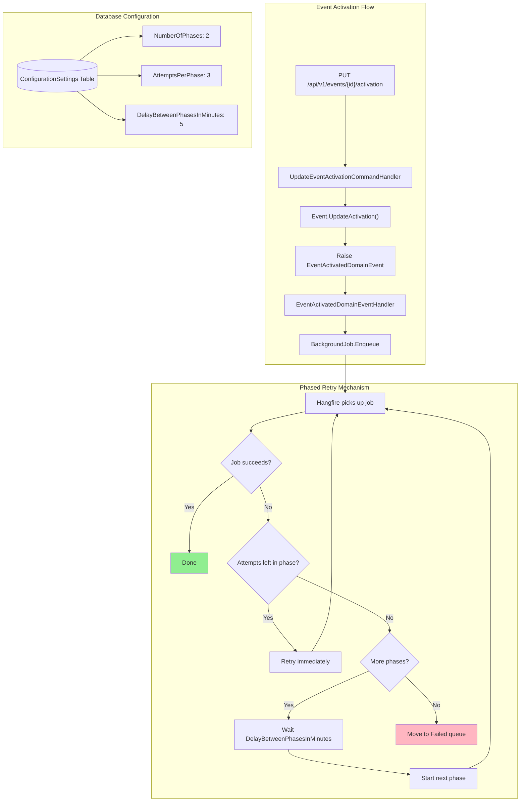

# Phased Retry Mechanism for Hangfire Jobs

## Overview

The phased retry mechanism provides a robust retry strategy for Hangfire background jobs. It divides retries into configurable phases, with immediate retries within each phase and configurable delays between phases.

## Flow Diagram



## Configuration Settings

Settings are stored in the `ConfigurationSettings` database table and can be modified at runtime.

| Setting | Config Key | Default | Description |
|---------|------------|---------|-------------|
| Number of Phases | `Hangfire:PhasedRetry:NumberOfPhases` | 2 | Total number of retry phases |
| Attempts Per Phase | `Hangfire:PhasedRetry:AttemptsPerPhase` | 3 | Immediate retry attempts within each phase |
| Delay Between Phases | `Hangfire:PhasedRetry:DelayBetweenPhasesInMinutes` | 5 | Wait time (minutes) between phases |

## How It Works

1. **Within each phase**: Immediate retries (no delay between attempts)
2. **Between phases**: Wait for configured delay (default: 5 minutes)
3. **After all phases exhausted**: Job moves to Failed queue

## Retry Example

### Default Configuration (2 phases x 3 attempts + 5min delay)

```
Phase 1: Attempt 1 -> Fail
Phase 1: Attempt 2 -> Fail
Phase 1: Attempt 3 -> Fail
[Wait 5 minutes]
Phase 2: Attempt 1 -> Fail
Phase 2: Attempt 2 -> Fail
Phase 2: Attempt 3 -> Fail
-> Moves to Failed queue
```

### Visual Timeline

```
+-------------------------------------------------------------+
| Phase 1                                                      |
|   Attempt 1 -> Fail                                          |
|   Attempt 2 -> Fail                                          |
|   Attempt 3 -> Fail                                          |
+-------------------------------------------------------------+
| [Wait 5 minutes]                                             |
+-------------------------------------------------------------+
| Phase 2                                                      |
|   Attempt 1 -> Fail                                          |
|   Attempt 2 -> Fail                                          |
|   Attempt 3 -> Fail                                          |
+-------------------------------------------------------------+
| All retries exhausted -> Moved to Failed queue               |
+-------------------------------------------------------------+
```

### Example with 3 Phases

```
Phase 1: Attempt 1 -> Fail ... Attempt 3 -> Fail
[Wait 5 minutes]
Phase 2: Attempt 1 -> Fail ... Attempt 3 -> Fail
[Wait 5 minutes]
Phase 3: Attempt 1 -> Fail ... Attempt 3 -> Fail
-> Moves to Failed queue
```

## Usage

### Creating a New Background Job

To use phased retry for any background job, simply add the `[PhasedRetry]` attribute:

```csharp
using Hayyacom.Api.Core.Infrastructure.BackgroundJobs;

[PhasedRetry]
public class MyNewJob : BaseBackgroundJob<MyNewJob>
{
    public MyNewJob(ISender sender, ILogger<MyNewJob> logger)
        : base(sender, logger) { }

    public async Task ExecuteAsync(Guid id, CancellationToken ct = default)
    {
        var command = new MyNewCommand(id);
        var result = await ExecuteCommandAsync(command, $"MyNewJob:{id}", ct);

        if (result.IsFailure)
            throw new InvalidOperationException($"Failed: {result.Error}");
    }
}
```

### Enqueuing the Job

```csharp
_backgroundJobClient.Enqueue<MyNewJob>(job => job.ExecuteAsync(myId, default));
```

## Modifying Settings

### Via SQL

```sql
-- Change to 3 phases
UPDATE "ConfigurationSettings"
SET "Value" = '3', "ModifiedOn" = NOW()
WHERE "Key" = 'Hangfire:PhasedRetry:NumberOfPhases';

-- Change attempts per phase to 5
UPDATE "ConfigurationSettings"
SET "Value" = '5', "ModifiedOn" = NOW()
WHERE "Key" = 'Hangfire:PhasedRetry:AttemptsPerPhase';

-- Change delay between phases to 10 minutes
UPDATE "ConfigurationSettings"
SET "Value" = '10', "ModifiedOn" = NOW()
WHERE "Key" = 'Hangfire:PhasedRetry:DelayBetweenPhasesInMinutes';
```

### Via API

Use the Configuration API endpoints:
- **REST**: `PUT /api/v1/configurations/{id}` with new value

**Note**: Settings are cached for 15 minutes. Changes take effect after cache expires.

## Monitoring Failed Jobs

Jobs that exhaust all retry phases are moved to the **Failed** queue in Hangfire.

1. Access Hangfire Dashboard at `/hangfire`
2. Navigate to the **Failed** tab
3. From there you can:
   - View failure details and exception stack traces
   - Manually retry individual jobs
   - Delete failed jobs

## Architecture

### Core Infrastructure Files

| File | Purpose |
|------|---------|
| `Core/Infrastructure/BackgroundJobs/PhasedRetryAttribute.cs` | Marker attribute for jobs |
| `Core/Infrastructure/BackgroundJobs/PhasedRetryFilter.cs` | Hangfire filter implementing retry logic |
| `Core/Infrastructure/BackgroundJobs/PhasedRetrySettings.cs` | Settings DTO |
| `Core/Infrastructure/BackgroundJobs/IPhasedRetrySettingsService.cs` | Service interface |
| `Core/Infrastructure/BackgroundJobs/PhasedRetrySettingsService.cs` | Service implementation (reads from DB) |
| `Core/Infrastructure/BackgroundJobs/BaseBackgroundJob.cs` | Base class for jobs |

### Configuration Files

| File | Purpose |
|------|---------|
| `Features/Configuration/Domain/ConfigKeys.cs` | Type-safe config key constants |
| `Infrastructure/Persistence/Seeders/ConfigurationSeeder.cs` | Seeds default values |
