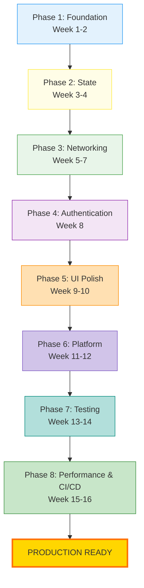
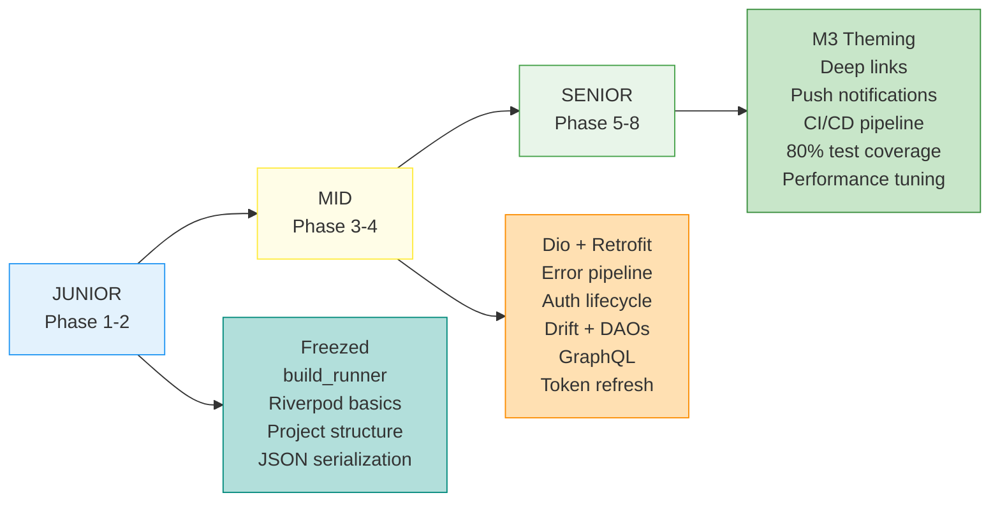
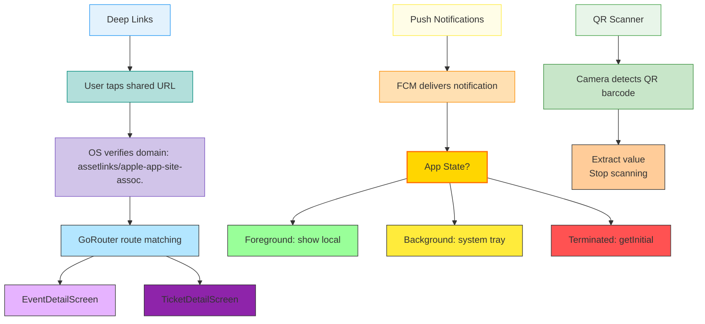
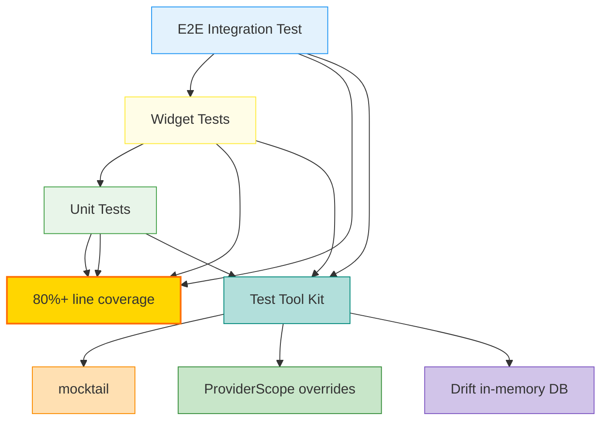

# Deep Learning Roadmap

---

## How to Use This Roadmap

Each phase builds on the previous one. Complete all concepts in a phase before moving to the next. The **project** column shows which milestone of the capstone project exercises that concept.

---

## The Big Picture



---

## Skill Level Progression



---

## Phase 1: Foundation Layer (Weeks 1–2)

> Goal: Master the tools everything else is built on.

| #   | Concept                                                                 | Source Doc                                 | Project Milestone |
| --- | ----------------------------------------------------------------------- | ------------------------------------------ | ----------------- |
| 1.1 | Dart sealed classes & pattern matching                                  | `state-management.md`, `error-handling.md` | M1                |
| 1.2 | Freezed: immutable data classes, unions, `copyWith`                     | `code-generation.md`                       | M1                |
| 1.3 | `build_runner` engine: how generators work, `part` directives, commands | `code-generation.md`                       | M1                |
| 1.4 | `json_serializable`: `fromJson` / `toJson`                              | `code-generation.md`                       | M1                |
| 1.5 | Project structure: feature slices, barrel files, layer responsibilities | `project-structure.md`                     | M1                |

### Deliverable

- Create 3 Freezed entity classes with JSON serialization
- Set up the project scaffold with 2 empty feature slices
- Run `build_runner` successfully with all generators

```mermaid
graph LR
  A[@freezed] --> B[build_runner]
  B --> C[.freezed.dart]
  A --> D[@JsonSerializable]
  D --> B
  A --> E[@riverpod]
  E --> B
  B --> F[.g.dart]
  B --> G[.g.dart]
  C --> H[Your code compiles]
  F --> H
  G --> H
  style A fill:#99ccff,stroke:#333
  style B fill:#ffe0b2,stroke:#fb8c00
  style C fill:#b2dfdb,stroke:#00897b
  style D fill:#e3f2fd,stroke:#2196f3
  style E fill:#f3e5f5,stroke:#8e24aa
  style F fill:#c8e6c9,stroke:#388e3c
  style G fill:#d1c4e9,stroke:#7e57c2
  style H fill:#ffd600,stroke:#ff6f00,stroke-width:2px
```

---

## Phase 2: State Management Mastery (Weeks 3–4)

> Goal: Own every Riverpod pattern used in production.

| #   | Concept                                                                  | Source Doc             | Project Milestone |
| --- | ------------------------------------------------------------------------ | ---------------------- | ----------------- |
| 2.1 | Provider types: `Provider`, `FutureProvider`, `@riverpod` function/class | `state-management.md`  | M2                |
| 2.2 | `AsyncNotifier` controller pattern (one per screen)                      | `state-management.md`  | M2                |
| 2.3 | `ref.watch` vs `ref.read` vs `ref.listen`                                | `state-management.md`  | M2                |
| 2.4 | Family providers (parameterized)                                         | `state-management.md`  | M2                |
| 2.5 | Derived providers, `select()` for rebuild optimization                   | `state-management.md`  | M2                |
| 2.6 | Feature-scoped DI wiring (`providers.dart`)                              | `project-structure.md` | M2                |
| 2.7 | `riverpod_generator` codegen deep dive                                   | `code-generation.md`   | M2                |

### Deliverable

- Build a feature with full provider graph: API service → repository → controller → screen
- Demonstrate `select()` optimization with DevTools rebuild tracking

````
Phase 2 — Riverpod Provider Graph:

```mermaid
flowchart TD
  Widget[Widget Tree] --> CP[controllerProvider]
  CP --> OLCP[orderListControllerProvider\n(AsyncNotifier)]
  OLCP --> RP[repositoryProvider]
  RP --> AP[apiProvider]
  RP --> DP[daoProvider]
  AP --> Dio[Dio]
  DP --> SQLite[SQLite]
  OLCP --> UI[UI]
  style Widget fill:#e3f2fd,stroke:#2196f3
  style CP fill:#fffde7,stroke:#ffeb3b
  style OLCP fill:#e8f5e9,stroke:#43a047
  style RP fill:#f3e5f5,stroke:#8e24aa
  style AP fill:#b2dfdb,stroke:#00897b
  style DP fill:#ffe0b2,stroke:#fb8c00
  style Dio fill:#c8e6c9,stroke:#388e3c
  style SQLite fill:#d1c4e9,stroke:#7e57c2
  style UI fill:#ffd600,stroke:#ff6f00,stroke-width:2px
```

ref.watch → reactive (rebuilds UI on change)
ref.read → one-shot (callbacks, event handlers)
ref.listen → side effects (snackbars, navigation)
select() → watch only a subset (minimize rebuilds)

```

---

## Phase 3: Networking & Data Layer (Weeks 5–7)

> Goal: Build a complete remote + local data pipeline.

| #   | Concept                                                      | Source Doc                      | Project Milestone |
| --- | ------------------------------------------------------------ | ------------------------------- | ----------------- |
| 3.1 | Dio client: singleton, base URL, timeouts, interceptor chain | `networking.md`                 | M3                |
| 3.2 | Retrofit: `@RestApi()`, type-safe API services               | `networking.md`                 | M3                |
| 3.3 | `AppException` sealed class + `ErrorInterceptor`             | `error-handling.md`             | M3                |
| 3.4 | Auth interceptor: token injection, 401 handling              | `authentication.md`             | M3                |
| 3.5 | Repository pattern: remote-first with local fallback         | `database.md`                   | M3                |
| 3.6 | Drift: table definitions, DAOs, queries, streams             | `database.md`, `drift_tutor.md` | M4                |
| 3.7 | Drift migrations: version bumps, incremental steps           | `database.md`                   | M4                |
| 3.8 | GraphQL client: `gql_dio_link`, codegen, queries             | `graphql.md`                    | M5                |

### Deliverable

- Complete networking layer with error interceptor
- Retrofit API service + Drift DAO for one feature
- Repository implementation with cache fallback on network error

```

Phase 3 — The Data Pipeline:

```mermaid
flowchart TD
  Server[Server (REST + GraphQL)] --> DioClient[Dio Client]
  DioClient --> ErrorInterceptor[Error Interceptor]
  ErrorInterceptor --> AuthInterceptor[Auth Interceptor]
  AuthInterceptor --> LogInterceptor[Log Interceptor]
  LogInterceptor --> AppException[AppException (sealed)]
  AppException --> Repository[Repository (data layer)]
  Repository --> Controller[Controller (AsyncValue)]
  Controller --> Data[data]
  Controller --> Loading[loading]
  Controller --> Error[error]
  Repository --> Drift[Drift (offline fallback)]
  style Server fill:#e3f2fd,stroke:#2196f3
  style DioClient fill:#fffde7,stroke:#ffeb3b
  style ErrorInterceptor fill:#e8f5e9,stroke:#43a047
  style AuthInterceptor fill:#f3e5f5,stroke:#8e24aa
  style LogInterceptor fill:#b2dfdb,stroke:#00897b
  style AppException fill:#ffe0b2,stroke:#fb8c00
  style Repository fill:#c8e6c9,stroke:#388e3c
  style Controller fill:#d1c4e9,stroke:#7e57c2
  style Data fill:#99ff99,stroke:#333
  style Loading fill:#ffeb3b,stroke:#333
  style Error fill:#ff5252,stroke:#333
  style Drift fill:#b3e6ff,stroke:#333
```

---

## Phase 4: Authentication System (Week 8)

> Goal: Implement the full auth lifecycle.

| #   | Concept                                                              | Source Doc          | Project Milestone |
| --- | -------------------------------------------------------------------- | ------------------- | ----------------- |
| 4.1 | `AuthState` sealed class (authenticated / unauthenticated / loading) | `authentication.md` | M3                |
| 4.2 | `AuthController` Riverpod notifier + derived providers               | `authentication.md` | M3                |
| 4.3 | `QueuedInterceptor` for token refresh (serialize concurrent 401s)    | `authentication.md` | M3                |
| 4.4 | GoRouter auth guard with automatic redirect                          | `authentication.md` | M3                |
| 4.5 | Token persistence via `SharedPreferences`                            | `authentication.md` | M3                |

### Deliverable

- Full login → authenticated → token refresh → logout → redirect cycle
- Simulate 401 → refresh → retry flow

````

Phase 4 — Auth Lifecycle:

```mermaid
flowchart TD
  User[User opens app] --> GoRouter[GoRouter Auth Guard]
  GoRouter --> AuthController[AuthController (Riverpod)]
  AuthController --> Unauth[Unauthenticated]
  Unauth --> Login[login()]
  Login --> Loading[Loading]
  Loading --> Authenticated[Authenticated {user, access, refresh}]
  Authenticated --> TokenRefresh[Token Refresh Flow (401)]
  TokenRefresh --> QueuedInterceptor[QueuedInterceptor _tryRefresh()]
  QueuedInterceptor --> Success[Success]
  QueuedInterceptor --> Failure[Failure]
  Success --> Retry[Retry original request]
  Failure --> Logout[logout()]
  Logout --> Redirect[redirect to login]
  style User fill:#e3f2fd,stroke:#2196f3
  style GoRouter fill:#fffde7,stroke:#ffeb3b
  style AuthController fill:#e8f5e9,stroke:#43a047
  style Unauth fill:#f3e5f5,stroke:#8e24aa
  style Login fill:#b2dfdb,stroke:#00897b
  style Loading fill:#ffe0b2,stroke:#fb8c00
  style Authenticated fill:#c8e6c9,stroke:#388e3c
  style TokenRefresh fill:#d1c4e9,stroke:#7e57c2
  style QueuedInterceptor fill:#ffd600,stroke:#ff6f00,stroke-width:2px
  style Success fill:#99ff99,stroke:#333
  style Failure fill:#ff5252,stroke:#333
  style Retry fill:#b3e6ff,stroke:#333
  style Logout fill:#ffeb3b,stroke:#333
  style Redirect fill:#ff6f00,stroke:#333
```

---

## Phase 5: UI Polish & Theming (Weeks 9–10)

> Goal: Production-quality visual layer.

| #   | Concept                                                          | Source Doc             | Project Milestone |
| --- | ---------------------------------------------------------------- | ---------------------- | ----------------- |
| 5.1 | M3 `ColorScheme.fromSeed()` + brand overrides                    | `theming.md`           | M6                |
| 5.2 | `ThemeExtension<AppColors>` for custom semantic tokens           | `theming.md`           | M6                |
| 5.3 | Dark mode: separate light/dark extensions, persistent preference | `theming.md`           | M6                |
| 5.4 | `AppSpacing.of(context)` elastic spacing                         | `responsive-sizing.md` | M6                |
| 5.5 | Breakpoint-driven layout adaptation                              | `responsive-sizing.md` | M6                |
| 5.6 | Slang i18n: type-safe translations, adding locales               | `i18n.md`              | M6                |
| 5.7 | SVG → `.vec` pre-compilation                                     | `svg-icons.md`         | M6                |
| 5.8 | Native splash screen (Android 12+ adaptive)                      | `native-splash.md`     | M6                |

### Deliverable

- Complete theme with light/dark, custom semantic colors
- One screen rendered responsively on phone + tablet
- Two locales with full coverage

````
Phase 5 — Theming & Responsive Architecture:

```mermaid
graph TD
  Seed[Seed Color (#AB2138)] --> ColorScheme[ColorScheme.fromSeed()]
  ColorScheme --> Primary[primary, onPrimary, primaryContainer]
  ColorScheme --> Secondary[secondary, tertiary]
  ColorScheme --> Surface[surface, onSurface, surfaceContainer]
  ColorScheme --> Error[error, onError]
  ColorScheme --> Brand[Brand overrides from Figma]
  Brand --> ThemeExt[ThemeExtension<AppColors>]
  ThemeExt --> Success[success]
  ThemeExt --> Warning[warning]
  ThemeExt --> Info[info]
  Success --> Light[LIGHT]
  Success --> Dark[DARK]
  Warning --> Light
  Warning --> Dark
  Info --> Light
  Info --> Dark
  style Seed fill:#e3f2fd,stroke:#2196f3
  style ColorScheme fill:#fffde7,stroke:#ffeb3b
  style Brand fill:#e8f5e9,stroke:#43a047
  style ThemeExt fill:#f3e5f5,stroke:#8e24aa
  style Success fill:#b2dfdb,stroke:#00897b
  style Warning fill:#ffe0b2,stroke:#fb8c00
  style Info fill:#c8e6c9,stroke:#388e3c
  style Light fill:#d1c4e9,stroke:#7e57c2
  style Dark fill:#ffd600,stroke:#ff6f00,stroke-width:2px
```

---

## Phase 6: Platform Features (Weeks 11–12)

> Goal: Native integration that users expect.

| #   | Concept                                                     | Source Doc              | Project Milestone |
| --- | ----------------------------------------------------------- | ----------------------- | ----------------- |
| 6.1 | Deep linking: App Links (Android), Universal Links (iOS)    | `deep-linking.md`       | M7                |
| 6.2 | Push notifications: FCM setup, channels, permission flow    | `push-notifications.md` | M7                |
| 6.3 | Foreground/background/terminated notification handling      | `push-notifications.md` | M7                |
| 6.4 | QR scanning: `mobile_scanner`, scan window, camera controls | `qr-scanning.md`        | M7                |
| 6.5 | Adaptive widgets (dialogs, pickers, switches)               | `platform-specific.md`  | M7                |
| 6.6 | Remote configuration: fetch, cache, typed getters           | `remote-config.md`      | M5                |
| 6.7 | Environment config: `--dart-define-from-file`               | `environment-config.md` | M5                |

### Deliverable

- Deep link opens specific screen with correct parameters
- Push notification received in foreground, tapped → navigated to correct screen
- QR scan → process result → navigate

```
Phase 6 — Platform Integration Map:



---

## Phase 7: Testing & Quality (Weeks 13–14)

> Goal: Ship with confidence.

| #   | Concept                                              | Source Doc    | Project Milestone |
| --- | ---------------------------------------------------- | ------------- | ----------------- |
| 7.1 | Unit tests: entities, repositories with `mocktail`   | `testing.md`  | M8                |
| 7.2 | Controller tests: `ProviderContainer` with overrides | `testing.md`  | M8                |
| 7.3 | Widget tests: `testApp()` wrapper, `pumpAndSettle`   | `testing.md`  | M8                |
| 7.4 | Integration tests: full feature flows                | `testing.md`  | M8                |
| 7.5 | Drift in-memory database testing                     | `database.md` | M8                |
| 7.6 | 80% coverage per feature slice                       | `testing.md`  | M8                |

### Deliverable

- 80%+ coverage on two feature slices
- Widget test for every screen
- One end-to-end integration test

```
Phase 7 — Testing Pyramid:



---

## Phase 8: Performance & CI/CD (Weeks 15–16)

> Goal: Production readiness.

| #   | Concept                                                          | Source Doc       | Project Milestone |
| --- | ---------------------------------------------------------------- | ---------------- | ----------------- |
| 8.1 | Performance profiling: DevTools, frame budget monitoring         | `performance.md` | M9                |
| 8.2 | `const` constructors, widget splitting, `RepaintBoundary`        | `performance.md` | M9                |
| 8.3 | List performance: `ListView.builder`, `itemExtent`               | `performance.md` | M9                |
| 8.4 | Image caching: `cached_network_image`, size-appropriate requests | `performance.md` | M9                |
| 8.5 | GitHub Actions CI: analyze → test → build                        | `ci-cd.md`       | M9                |
| 8.6 | Fastlane: Match, Firebase App Distribution                       | `ci-cd.md`       | M9                |
| 8.7 | Shorebird OTA patching                                           | `ci-cd.md`       | M9                |

### Deliverable

- All frames under 16ms budget on mid-range device
- CI pipeline passing on every push
- Beta distributed via Firebase App Distribution

```
Phase 8 — CI/CD Pipeline:

   Developer pushes code
          │
          ▼
  ┌───────────────────────────────────────────────────────┐
  │              GitHub Actions CI                          │
  │                                                         │
  │  ┌──────────┐   ┌──────────┐   ┌────────────────────┐ │
  │  │  dart     │──▶│ flutter  │──▶│   flutter build    │ │
  │  │  format   │   │  test    │   │   apk --release    │ │
  │  │  --check  │   │ --cover  │   │   ios --no-codesign│ │
  │  └──────────┘   └──────────┘   └─────────┬──────────┘ │
  │                                           │            │
  └───────────────────────────────────────────┼────────────┘
                                              │
                       ┌──────────────────────┼───────────────┐
                       │                      │               │
                       ▼                      ▼               ▼
               ┌──────────────┐     ┌──────────────┐  ┌────────────┐
               │   Fastlane   │     │   Fastlane   │  │  Shorebird │
               │   Android    │     │     iOS      │  │  OTA Patch │
               │              │     │              │  │            │
               │ Firebase App │     │  Match certs │  │ Dart-only  │
               │ Distribution │     │  App Store / │  │ patches    │
               │              │     │  Firebase    │  │ skip store │
               └──────────────┘     └──────────────┘  └────────────┘
                       │                    │                │
                       └────────────┬───────┘                │
                                    ▼                        ▼
                            ┌──────────────┐        ┌──────────────┐
                            │   Testers    │        │  Production  │
                            │  get beta    │        │  users get   │
                            │  instantly   │        │  hot patch   │
                            └──────────────┘        └──────────────┘

  Performance Budgets:
  ┌────────────────┬───────────────────────────────────┐
  │ Frame time     │  < 16ms  ████████░░  (60fps)      │
  │ Cold start     │  < 3s    ███░░░░░░░               │
  │ APK size       │  < 30MB  ██████░░░░               │
  │ Memory         │  < 200MB █████████░               │
  │ Crash-free     │  99.5%   ██████████               │
  └────────────────┴───────────────────────────────────┘
```

---

## Visual Dependency Graph

```
Phase 1: Foundation
    │
    ▼
Phase 2: State Management ──────────────┐
    │                                    │
    ▼                                    │
Phase 3: Networking & Data ◄─────────────┤
    │                                    │
    ▼                                    │
Phase 4: Authentication                  │
    │                                    │
    ├───────────────┐                    │
    ▼               ▼                    │
Phase 5: UI     Phase 6: Platform ◄──────┘
    │               │
    └───────┬───────┘
            ▼
    Phase 7: Testing
            │
            ▼
    Phase 8: Performance & CI/CD
```

---

## Week-by-Week Calendar

```
Week   1   2   3   4   5   6   7   8   9  10  11  12  13  14  15  16
     ┌───┬───┬───┬───┬───┬───┬───┬───┬───┬───┬───┬───┬───┬───┬───┬───┐
  P1 │███│███│   │   │   │   │   │   │   │   │   │   │   │   │   │   │
     ├───┼───┼───┼───┼───┼───┼───┼───┼───┼───┼───┼───┼───┼───┼───┼───┤
  P2 │   │   │███│███│   │   │   │   │   │   │   │   │   │   │   │   │
     ├───┼───┼───┼───┼───┼───┼───┼───┼───┼───┼───┼───┼───┼───┼───┼───┤
  P3 │   │   │   │   │███│███│███│   │   │   │   │   │   │   │   │   │
     ├───┼───┼───┼───┼───┼───┼───┼───┼───┼───┼───┼───┼───┼───┼───┼───┤
  P4 │   │   │   │   │   │   │   │███│   │   │   │   │   │   │   │   │
     ├───┼───┼───┼───┼───┼───┼───┼───┼───┼───┼───┼───┼───┼───┼───┼───┤
  P5 │   │   │   │   │   │   │   │   │███│███│   │   │   │   │   │   │
     ├───┼───┼───┼───┼───┼───┼───┼───┼───┼───┼───┼───┼───┼───┼───┼───┤
  P6 │   │   │   │   │   │   │   │   │   │   │███│███│   │   │   │   │
     ├───┼───┼───┼───┼───┼───┼───┼───┼───┼───┼───┼───┼───┼───┼───┼───┤
  P7 │   │   │   │   │   │   │   │   │   │   │   │   │███│███│   │   │
     ├───┼───┼───┼───┼───┼───┼───┼───┼───┼───┼───┼───┼───┼───┼───┼───┤
  P8 │   │   │   │   │   │   │   │   │   │   │   │   │   │   │███│███│
     └───┴───┴───┴───┴───┴───┴───┴───┴───┴───┴───┴───┴───┴───┴───┴───┘

  P = Phase    ███ = Active learning + building
```
```
````
