# Flutter Study Notes: DTO & DTO Mapping

---

## What is a DTO?

A **DTO (Data Transfer Object)** is a simple class used to transfer data between different parts of a system, especially between your app and external sources like APIs or databases.

- **DTOs** represent the shape of data as received from or sent to an API.
- They are often different from your app's core business models (entities).

---

## Why Use DTOs?

- APIs often return data with extra fields, different naming, or formats that don't match your app's needs.
- DTOs help keep your domain models clean and focused on business logic.
- They make serialization/deserialization easy and reliable.
- They allow you to adapt to backend changes without breaking your app's core logic.

---

## DTO vs Entity

| Aspect        | DTO (Data Layer)      | Entity (Domain Layer)     |
| ------------- | --------------------- | ------------------------- |
| Purpose       | API/data transfer     | Business logic/model      |
| Mutability    | Usually immutable     | Always immutable          |
| Serialization | Yes (fromJson/toJson) | Sometimes (rarely needed) |
| Extra Fields  | May have extra fields | Only core fields          |
| Mapping       | toEntity()            | -                         |

---

## Professional Mermaid Diagrams: DTO & Mapping

### API → DTO → Entity → UI Flow

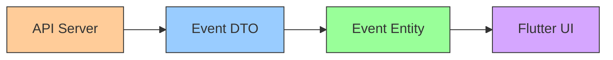

### Clean Architecture Data Flow

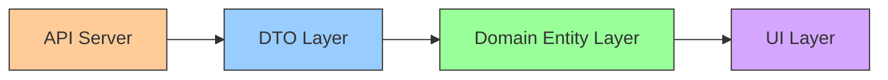

### DTO to Entity Mapping Sequence

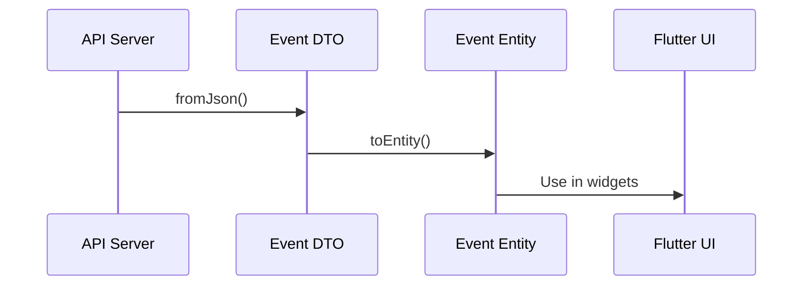

### Class Diagram: DTO vs Entity

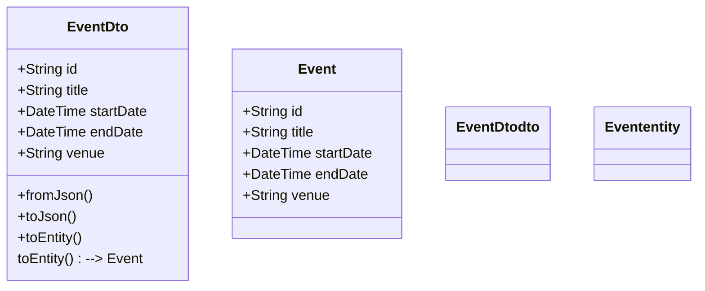

---

## Real Flutter Example: DTO & Mapping

```dart
import 'package:freezed_annotation/freezed_annotation.dart';
import 'event.dart'; // domain entity

part 'event_dto.freezed.dart';
part 'event_dto.g.dart';

@freezed
class EventDto with _$EventDto {
  const factory EventDto({
    required String id,
    required String title,
    required DateTime startDate,
    required DateTime endDate,
    required String venue,
  }) = _EventDto;

  factory EventDto.fromJson(Map<String, dynamic> json) => _$EventDtoFromJson(json);

  // Mapping: Convert DTO to domain entity
  Event toEntity() => Event(
    id: id,
    title: title,
    startDate: startDate,
    endDate: endDate,
    venue: venue,
  );
}
```

---

## Common Mistakes

- Mixing DTOs and entities (leads to messy code)
- Not handling nulls or missing fields from API
- Forgetting to run build_runner for code generation
- Adding business logic to DTOs (should be pure data)
- Not separating data and domain layers

---

## Barrel Files — Deep Dive

### What is a Barrel File?

A barrel file is a Dart file that exports all public APIs for a feature. It acts as the single entry point for importing feature code elsewhere.

### Why Use Barrel Files?

- Simplifies imports: `import 'features/events/events.dart';` instead of many individual files
- Enforces modularity: Only public APIs are exposed
- Makes refactoring easier: Change internal structure without breaking consumers
- Prevents leaking internal details: Only export what should be public

### Real-World Example

```dart
// features/events/events.dart
export 'domain/entities/event.dart';
export 'data/models/event_dto.dart';
export 'providers.dart';
export 'presentation/screens/event_list_screen.dart';
export 'presentation/controllers/event_list_controller.dart';
```

### Best Practices

- Only export files that are part of the public API
- Do not export internal helpers or private files
- Use one barrel file per feature
- Keep barrel files updated as features evolve

### Common Mistakes

- Exporting everything (including private/internal files)
- Not using barrel files, leading to messy imports
- Forgetting to update barrel files after refactoring
- Using barrel files for unrelated features (breaks modularity)

### Performance & Maintainability

- Barrel files do not impact runtime performance, but greatly improve code maintainability and readability
- They make onboarding new developers easier

---

## Barrel Files — Visual Explanation & Example

### Mermaid Diagram: Feature Barrel File Structure

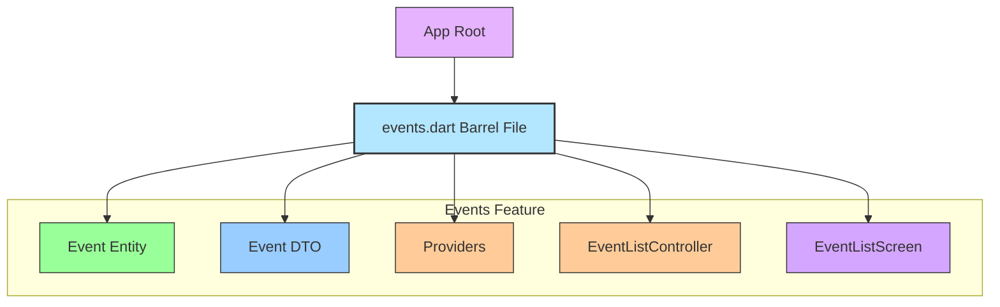

---

### Example: Barrel File for Tickets Feature

```dart
// lib/features/tickets/tickets.dart

export 'domain/entities/ticket.dart';
export 'data/models/ticket_dto.dart';
export 'providers.dart';
export 'presentation/screens/ticket_list_screen.dart';
export 'presentation/controllers/ticket_list_controller.dart';
```

---

### How Barrel Files Simplify Imports

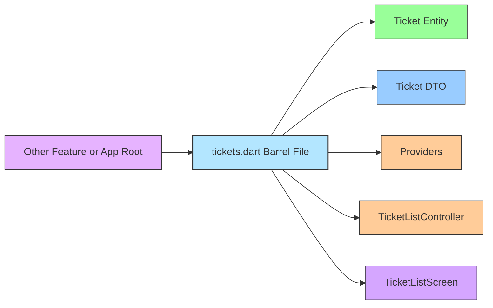

---

## Environment Management in Flutter (flutter_dotenv)

### Overview

Managing multiple environments (dev, staging, prod) is essential for scalable Flutter apps. The flutter_dotenv package allows you to load environment variables from .env files at runtime, enabling easy switching and secure configuration.

### Visual Diagram: Environment Loading Pipeline

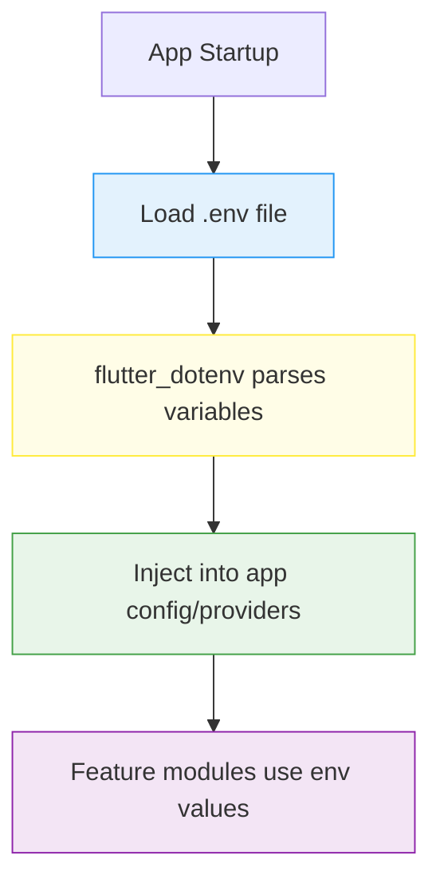

---

### Step-by-Step Example

#### 1. Create .env Files

- `.env.dev`:
  ```env
  API_BASE_URL=https://api-dev.eventhub.com
  IS_TICKET_SALES_ENABLED=true
  MAX_UPLOAD_SIZE_BYTES=10485760
  ```
- `.env.staging`:
  ```env
  API_BASE_URL=https://api-staging.eventhub.com
  IS_TICKET_SALES_ENABLED=true
  MAX_UPLOAD_SIZE_BYTES=10485760
  ```
- `.env.prod`:
  ```env
  API_BASE_URL=https://api.eventhub.com
  IS_TICKET_SALES_ENABLED=false
  MAX_UPLOAD_SIZE_BYTES=5242880
  ```

#### 2. Add flutter_dotenv Dependency

```yaml
# pubspec.yaml
# ...existing code...
flutter_dotenv: ^5.1.0
# ...existing code...
```

#### 3. Load Environment in main.dart

```dart
import 'package:flutter_dotenv/flutter_dotenv.dart';

void main() async {
  await dotenv.load(fileName: ".env.dev"); // Change to .env.staging or .env.prod as needed
  runApp(MyApp());
}
```

#### 4. Access Variables Anywhere

```dart
import 'package:flutter_dotenv/flutter_dotenv.dart';

final apiBaseUrl = dotenv.env['API_BASE_URL'];
final isTicketSalesEnabled = dotenv.env['IS_TICKET_SALES_ENABLED'] == 'true';
final maxUploadSize = int.parse(dotenv.env['MAX_UPLOAD_SIZE_BYTES'] ?? '5242880');
```

---

### Best Practices

- Never commit production secrets to version control.
- Use .env files for API endpoints, feature flags, and limits.
- Switch environment files using build scripts or CI/CD.
- Validate required keys at startup.

---

### Checklist

- [x] .env files created for each environment
- [x] flutter_dotenv added to pubspec.yaml
- [x] main.dart loads correct .env file
- [x] Providers/services use env variables

---

### Common Mistakes

- Forgetting to load the .env file before runApp()
- Using incorrect file names (case-sensitive)
- Not parsing string values to bool/int

---

### Advanced: CI/CD Integration

- Use build scripts to select .env file per build:
  - `flutter build apk --dart-define=ENV=prod`
  - In main.dart, load file based on ENV

---

## Summary

- **DTOs** are for data transfer and serialization.
- **Entities** are for business logic and core modeling.
- **Mapping** keeps your architecture clean and maintainable.
- Use `@JsonSerializable` and Freezed for robust, immutable DTOs.
- Always separate DTOs and entities for scalable Flutter apps.

---

---

# M2 — State Management Layer: Complete Deep Notes

> Everything built in Milestone 2. Read top to bottom. Every concept is explained with diagrams, code, and real examples from our EventHub project.

---

## The Problem We Are Solving (Why Any of This Exists)

Imagine you are a junior developer. You get a task: "Build an events list screen." You open a StatefulWidget and start writing:

```dart
// ❌ THE JUNIOR APPROACH — Do NOT do this
class EventListScreen extends StatefulWidget { ... }

class _EventListScreenState extends State<EventListScreen> {
  bool isLoading = false;
  bool hasError = false;
  String? errorMessage;
  List<Event> events = [];
  int currentPage = 1;
  bool hasMore = true;

  @override
  void initState() {
    super.initState();
    _loadEvents();
  }

  Future<void> _loadEvents() async {
    setState(() => isLoading = true);
    try {
      final result = await EventApi().getEvents(page: currentPage);
      setState(() {
        events = result;
        isLoading = false;
      });
    } catch (e) {
      setState(() {
        hasError = true;
        errorMessage = e.toString();
        isLoading = false;
      });
    }
  }
  // ... 200 more lines of spaghetti
}
```

**What is wrong with this approach?**

| Problem              | Description                                                     |
| -------------------- | --------------------------------------------------------------- |
| Not testable         | You cannot test `_EventListScreenState` in isolation            |
| Business logic in UI | The screen knows about the API, pagination, errors              |
| Race conditions      | Two taps can trigger two `_loadEvents()` calls simultaneously   |
| No reuse             | Another screen that needs events has to duplicate all this code |
| No reactivity        | If data changes somewhere else, this screen never knows         |
| setState everywhere  | Mutable state scattered across 10 `setState` calls              |

**The Riverpod approach separates these concerns into a clean, testable, reactive graph.**

---

## The 4-Layer Architecture — The Foundation of Everything

Every feature in our app follows exactly this structure. **Never deviate from it.**

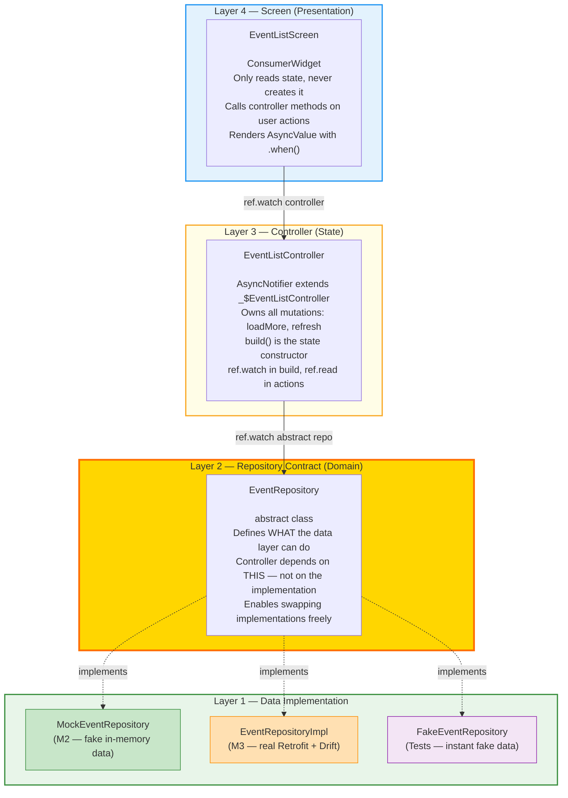

**The golden rule: each layer only knows about the layer directly below it.**

- Screen → knows Controller
- Controller → knows abstract Repository
- Repository → knows nothing above it

---

## Concept 1: Abstract Class (The Contract)

### File: `lib/features/event/domain/repositories/event_repository.dart`

```dart
abstract class EventRepository {
  Future<List<Event>> getEvents({
    int page = 1,
    int pageSize = 10,
    String? search,
  });

  Future<Event> getEventById(String id);
}
```

### What is `abstract class`?

An `abstract class` is a **contract**. It says: _"Any class that claims to be an EventRepository MUST have exactly these methods, with exactly these signatures."_

It has NO body code — it is only a shape definition.

**Real-world analogy:** Think of a job description. It says "must know how to cook pasta and pizza". It does NOT say HOW to cook them. That is the actual cook's job (the implementation). Different cooks can follow the same job description with completely different cooking techniques.

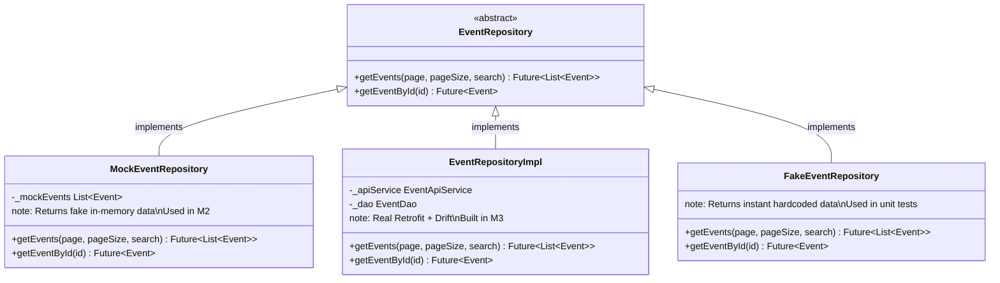

### Why `Future<List<Event>>` instead of just `List<Event>`?

`Future` means the result is **asynchronous** — it will arrive at some point in the future, not instantly. This is required because:

- Network calls take time (100ms–5000ms)
- Database reads take time
- You cannot freeze the UI while waiting

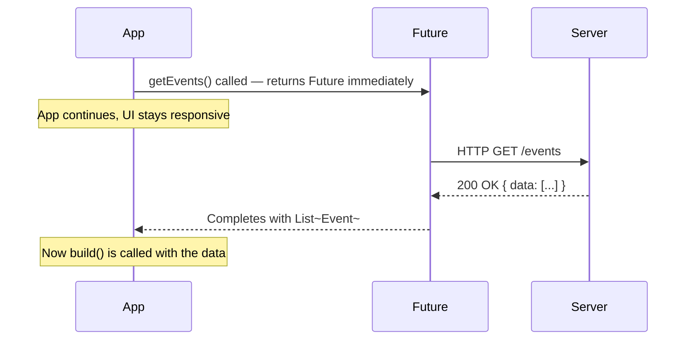

### What is `String? search`?

The `?` makes the parameter **nullable** — it can have a value (`"flutter"`) or be absent (`null`). If the user has not typed anything in the search box, we pass `null` to get all events unfiltered.

```dart
// These are all valid calls:
repository.getEvents();                         // search = null → all events
repository.getEvents(search: "flutter");        // search = "flutter" → filtered
repository.getEvents(page: 2, pageSize: 20);    // page 2, bigger page
```

---

## Concept 2: `implements` vs `extends` — A Critical Difference

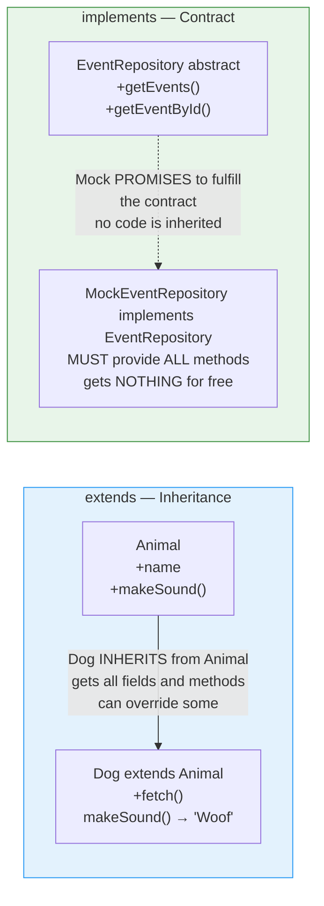

|                   | `extends`                             | `implements`                           |
| ----------------- | ------------------------------------- | -------------------------------------- |
| Gets parent code? | YES — inherits fields and methods     | NO — must write everything yourself    |
| Can override?     | YES (optional)                        | Must implement ALL methods (required)  |
| Multiple?         | Only one class                        | Can implement many interfaces          |
| Use when          | You want to reuse and extend behavior | You want to guarantee a shape/contract |

We use `implements` because `MockEventRepository` and `EventRepositoryImpl` have completely different internal code — there is nothing to inherit. We only want to guarantee they both fulfill the `EventRepository` contract.

---

## Concept 3: Riverpod Provider — What It Actually Is

### The Mental Model

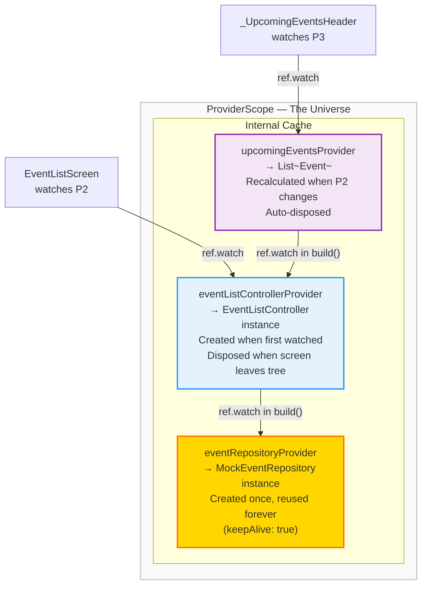

A Riverpod provider is:

1. **Lazily created** — not created until the first `ref.watch()` or `ref.read()` call
2. **Cached** — the same instance is returned to everyone who calls `ref.watch()`
3. **Reactive** — when it changes, everyone watching it automatically rebuilds
4. **Auto-disposed** — when nobody watches it, it is cleaned up (unless `keepAlive: true`)

### The `@riverpod` Annotation and Code Generation

```dart
// You write this:
@riverpod
EventRepository eventRepository(Ref ref) {
  return MockEventRepository();
}
```

`build_runner` generates this for you:

```dart
// Generated: providers.g.dart (DO NOT EDIT BY HAND)
final eventRepositoryProvider = Provider<EventRepository>((ref) {
  return eventRepository(ref);
});
```

The function name `eventRepository` + `Provider` suffix = `eventRepositoryProvider`. This is the global variable you use everywhere in `ref.watch()`.

### `keepAlive: true` vs Auto-dispose

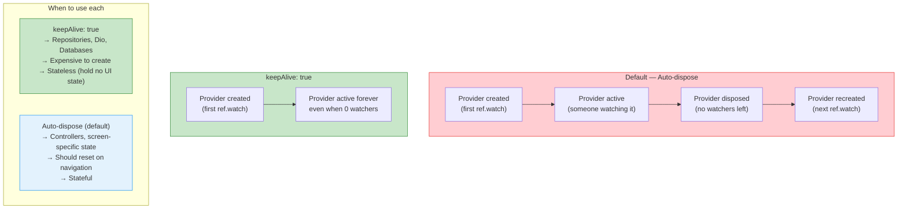

---

## Concept 4: `MockEventRepository` — Fake Data Line by Line

### File: `lib/features/event/data/repositories/mock_event_repository.dart`

```dart
class MockEventRepository implements EventRepository {

  static final List<Event> _mockEvents = List.generate(30, (i) {
    final daysOffset = i.isOdd ? -(i * 2) : (i * 3);
    return Event(
      id: 'event-$i',
      title: _eventTitles[i % _eventTitles.length],
      startDate: DateTime.now().add(Duration(days: daysOffset)),
      endDate: DateTime.now().add(Duration(days: daysOffset + 1)),
      venue: 'Dubai World Trade Centre, Hall ${(i % 5) + 1}',
    );
  });
```

### Keyword: `static final`

`static` means this field belongs to the **class itself**, not to any instance. There is only ONE list in memory, shared by all objects.

`final` means once created, the reference cannot be reassigned (immutable reference, though list contents are fixed here).

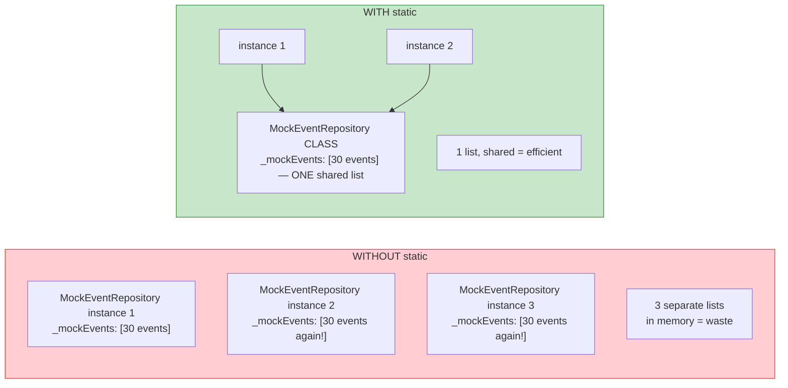

### The `List.generate` Pattern

```dart
List.generate(30, (i) {
  // i = 0, 1, 2, 3, ... 29
  return someValue;
})
```

`List.generate(count, builder)` creates a list of `count` items. For each item, it calls `builder(index)` where `index` starts at 0.

This is cleaner than writing a for loop:

```dart
// ❌ Verbose for loop equivalent:
final list = <Event>[];
for (int i = 0; i < 30; i++) {
  list.add(Event(...));
}

// ✅ Clean List.generate:
final list = List.generate(30, (i) => Event(...));
```

### The Ternary Operator Explained

```dart
final daysOffset = i.isOdd ? -(i * 2) : (i * 3);
//                 ^^^^^^^^   ^^^^^^^^   ^^^^^^^^
//                 condition  if true    if false
```

Exactly the same as:

```dart
int daysOffset;
if (i.isOdd) {
  daysOffset = -(i * 2);  // odd index → past event
} else {
  daysOffset = i * 3;     // even index → future event
}
```

**Why do we need past AND future events?** Because our `upcomingEventsProvider` filters for future events only. If ALL events were in the future, the filter would be meaningless and we would not be able to test it.

```mermaid
gantt
    title Events Timeline (first 10 events)
    dateFormat  X
    axisFormat  Day %s

    section Future (even i)
    event-0 (offset +0)   :0, 1
    event-2 (offset +6)   :6, 7
    event-4 (offset +12)  :12, 13
    event-6 (offset +18)  :18, 19
    event-8 (offset +24)  :24, 25

    section Past (odd i)
    event-1 (offset -2)   :-2, -1
    event-3 (offset -6)   :-6, -5
    event-5 (offset -10)  :-10, -9
    event-7 (offset -14)  :-14, -13
    event-9 (offset -18)  :-18, -17
```

### Modulo Operator `%` for Cycling Through a List

```dart
title: _eventTitles[i % _eventTitles.length],
//                  ^^^^^^^^^^^^^^^^^^^^^^
//                  i % 10 cycles: 0,1,2,3,4,5,6,7,8,9,0,1,2...
```

We have 10 titles but 30 events. Without modulo, `_eventTitles[10]` would crash (index out of range). With modulo:

```
i=0  → 0%10=0  → title[0]
i=1  → 1%10=1  → title[1]
...
i=9  → 9%10=9  → title[9]
i=10 → 10%10=0 → title[0] (cycles back!)
i=11 → 11%10=1 → title[1]
```

### The Pagination Math

```dart
final start = (page - 1) * pageSize;
if (start >= all.length) {
  return [];  // Signal: no more pages
}
final end = (start + pageSize).clamp(0, all.length);
return all.sublist(start, end);
```

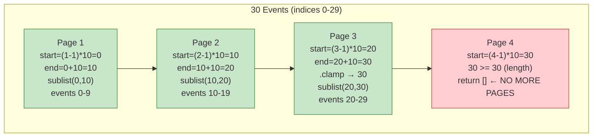

**`.clamp(min, max)`** — ensures a value stays within bounds. If `start+pageSize` exceeds the list length, `clamp` brings it down to the list length. Without this, `sublist` would throw a RangeError.

**`await Future.delayed(const Duration(milliseconds: 800))`** — pauses execution for 800ms to simulate a real network request. Without this, data appears instantly and you never see the loading spinner during development.

---

## Concept 5: The `providers.dart` Wiring File

### File: `lib/features/event/providers.dart`

```dart
import 'package:riverpod_annotation/riverpod_annotation.dart';
// ... other imports

part 'providers.g.dart';

@Riverpod(keepAlive: true)
EventRepository eventRepository(Ref ref) {
  return MockEventRepository();
}

@riverpod
List<Event> upcomingEvents(Ref ref) {
  final allEvents =
      ref.watch(eventListControllerProvider).valueOrNull ?? const [];
  return allEvents.where((e) => e.startDate.isAfter(DateTime.now())).toList();
}
```

### Why `part 'providers.g.dart'`?

The `part` directive tells Dart: "The generated file `providers.g.dart` is part of this file. They share the same library." This is required by `riverpod_generator` to inject the generated provider code. You never write `providers.g.dart` — `build_runner` creates it.

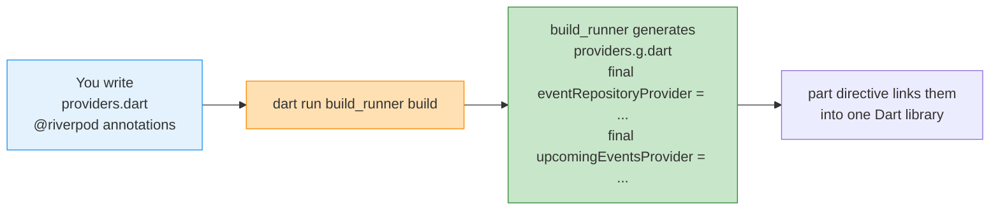

### The Derived Provider (`upcomingEventsProvider`) in Depth

```dart
@riverpod
List<Event> upcomingEvents(Ref ref) {
  final allEvents =
      ref.watch(eventListControllerProvider).valueOrNull ?? const [];
  return allEvents.where((e) => e.startDate.isAfter(DateTime.now())).toList();
}
```

**Step by step:**

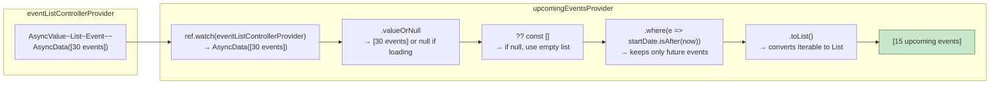

**Key insight:** When `eventListControllerProvider` changes (new data loaded), `upcomingEventsProvider` **automatically recalculates**. This is the power of `ref.watch` — a reactive chain. You never manually call "recalculate upcoming events". Riverpod does it automatically.

**Zero extra network calls.** The data is already loaded by `eventListControllerProvider`. `upcomingEventsProvider` only filters in-memory.

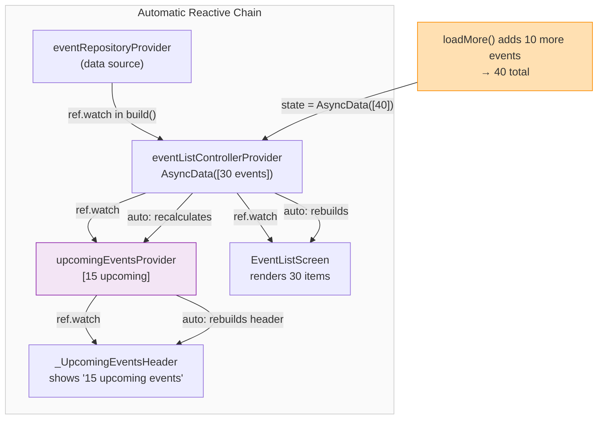

---

## Concept 6: `AsyncValue<T>` — The State Machine

`AsyncValue<T>` is the most important type in Riverpod. It replaces three buggy boolean variables with one explicit, compiler-checked type.

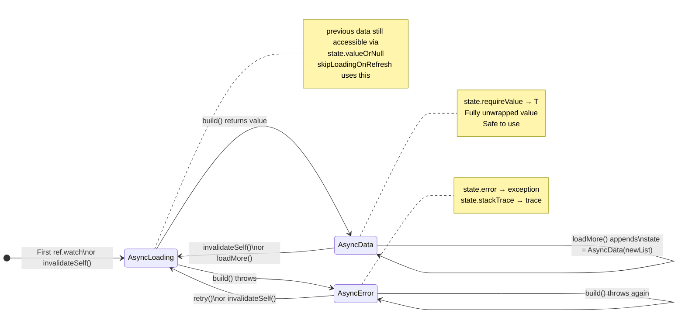

### `AsyncValue` vs Manual State Booleans

```dart
// ❌ Manual approach — 4 variables, bug-prone, can be in impossible states
bool isLoading = false;
bool hasError = false;
String? errorMessage;
List<Event>? data;
// Impossible state: isLoading=true AND hasError=true simultaneously!

// ✅ AsyncValue — ONE variable, impossible states are impossible
AsyncValue<List<Event>> state;
// Only ONE can be true at a time:
// AsyncLoading → loading
// AsyncData    → has data
// AsyncError   → has error
```

### `AsyncValue.guard()` — Safe Error Wrapping

```dart
// ❌ Manual try/catch — verbose, easy to forget
Future<void> loadMore() async {
  try {
    final result = await repository.getEvents();
    state = AsyncData(result);
  } catch (e, st) {
    state = AsyncError(e, st);
  }
}

// ✅ AsyncValue.guard() — clean, always correct
final result = await AsyncValue.guard(
  () => repository.getEvents(),
);
// result is AsyncData(events) on success
// result is AsyncError(e, st) on any thrown exception
```

```mermaid
flowchart LR
    subgraph guard["AsyncValue.guard(() => asyncCall())"]
        TRY["try:\nawait asyncCall()\n→ AsyncData(result)"]
        CATCH["catch (e, st):\n→ AsyncError(e, st)"]
        TRY -->|"success"| RESULT_OK["AsyncData(events)"]
        TRY -->|"exception thrown"| CATCH
        CATCH --> RESULT_ERR["AsyncError(exception, stackTrace)"]
    end
    style RESULT_OK fill:#c8e6c9,stroke:#388e3c
    style RESULT_ERR fill:#ffcdd2,stroke:#e53935
```

---

## Concept 7: `EventListController` — The Brain (Line by Line)

### File: `lib/features/event/presentation/controllers/event_list_controller.dart`

```dart
@riverpod
class EventListController extends _$EventListController {
  static const _pageSize = 10;
  int _currentPage = 1;
  bool _hasMore = true;
```

**`@riverpod` on a class** generates a class-based provider (AsyncNotifier).

**`extends _$EventListController`** — `_$EventListController` is the generated base class from `event_list_controller.g.dart`. It provides the `state`, `ref`, and `future` fields.

**`_currentPage` and `_hasMore`** — these are **instance variables** of the controller, not part of the `state`. They are internal bookkeeping that does not directly drive the UI.

### `build()` — The State Constructor

```dart
@override
Future<List<Event>> build() async {
  _currentPage = 1;
  _hasMore = true;
  return ref.watch(eventRepositoryProvider).getEvents(page: 1, pageSize: _pageSize);
}
```

`build()` is called in these situations:

```mermaid
flowchart TD
    TRIGGER1["First ref.watch(eventListControllerProvider)\ncalled by EventListScreen"]
    TRIGGER2["ref.invalidateSelf()\ncalled inside refresh()"]
    TRIGGER3["ref.invalidate(eventListControllerProvider)\ncalled from outside the notifier"]
    TRIGGER4["eventRepositoryProvider changes\n(only happens in tests — repository override)"]

    ALL["build() runs\n_currentPage = 1\n_hasMore = true\ncall getEvents(page:1)"]
    RESULT["state = AsyncLoading()\nthen AsyncData(events)\nor AsyncError(e)"]

    TRIGGER1 --> ALL
    TRIGGER2 --> ALL
    TRIGGER3 --> ALL
    TRIGGER4 --> ALL
    ALL --> RESULT
    style ALL fill:#fffde7,stroke:#f9a825
    style RESULT fill:#c8e6c9,stroke:#388e3c
```

### `loadMore()` — Appending Pages Without a Flash

```dart
Future<void> loadMore() async {
  if (!_hasMore) return;          // Guard 1: already on last page
  if (state is AsyncLoading) return;  // Guard 2: already fetching

  _currentPage++;

  final more = await AsyncValue.guard(
    () => ref.read(eventRepositoryProvider)
        .getEvents(page: _currentPage, pageSize: _pageSize),
  );

  more.when(
    data: (newEvents) {
      if (newEvents.isEmpty) {
        _hasMore = false;
        return;
      }
      state = AsyncData([...state.requireValue, ...newEvents]);
    },
    loading: () {},
    error: (e, st) {
      _currentPage--;   // Roll back so user can retry
      state = AsyncError(e, st);
    },
  );
}
```

**Why `ref.read` here (not `ref.watch`)?**

```mermaid
flowchart TD
    subgraph "ref.watch — Reactive Subscription"
        WATCH["ref.watch(eventRepositoryProvider)"]
        NOTE1["Creates a subscription\nIf repo changes → build() reruns\nCorrect in build()"]
    end
    subgraph "ref.read — One-Shot Read"
        READ["ref.read(eventRepositoryProvider)"]
        NOTE2["Reads current value once\nNo subscription created\nCorrect in callbacks and action methods"]
    end
    subgraph "What happens if you use ref.watch in loadMore"
        BUG["Every time loadMore() is called,\na new reactive subscription is created.\nSubscriptions accumulate, never disposed.\n= MEMORY LEAK + unpredictable reruns"]
    end
    style BUG fill:#ffcdd2,stroke:#e53935
    style NOTE1 fill:#c8e6c9,stroke:#388e3c
    style NOTE2 fill:#e3f2fd,stroke:#2196f3
```

**The spread operator `[...list1, ...list2]`:**

```dart
state = AsyncData([...state.requireValue, ...newEvents]);
//                 ^^^^^^^^^^^^^^^^^^^^   ^^^^^^^^^^
//                 existing 10 events     new 10 events
//                 = new list of 20 events (immutable!)
```

`...` unpacks a list into its individual elements. We create a **brand new list** that contains all existing events followed by all new events. We do NOT mutate the existing list — Riverpod detects changes by comparing references and will not trigger a rebuild if you mutate in place.

```mermaid
flowchart LR
    subgraph "Before loadMore"
        STATE1["state = AsyncData\n[event-0, event-1, ... event-9]"]
    end
    subgraph "After loadMore"
        STATE2["state = AsyncData\n[event-0, event-1, ... event-9,\n event-10, ... event-19]\nNEW LIST — not mutated!"]
    end
    STATE1 -->|"state = AsyncData([...old, ...new])"| STATE2
    style STATE2 fill:#c8e6c9,stroke:#388e3c
```

### `refresh()` — Pull to Refresh Explained

```dart
Future<void> refresh() async {
  ref.invalidateSelf();
  await future;
}
```

**Step by step:**

```mermaid
sequenceDiagram
    participant User
    participant RefreshIndicator as RefreshIndicator (Flutter)
    participant Controller as EventListController
    participant Repo as MockEventRepository

    User->>RefreshIndicator: Pull down gesture
    RefreshIndicator->>Controller: calls refresh()  [onRefresh callback]
    Controller->>Controller: ref.invalidateSelf()
    Note over Controller: build() is scheduled to run\nstate → AsyncLoading\nBUT skipLoadingOnRefresh:true in UI\nSo the list stays visible
    Controller->>Controller: _currentPage = 1 (reset in build)
    Controller->>Repo: getEvents(page:1)
    Repo-->>Controller: new data after 800ms
    Controller->>Controller: state = AsyncData(freshEvents)
    Note over Controller: await future here\nresumes only NOW
    Controller-->>RefreshIndicator: refresh() returns\n[Future completes]
    RefreshIndicator->>User: Spinner closes ✅
```

**Why `await future` is absolutely critical:**

```dart
// ❌ WRONG — spinner closes BEFORE data arrives
Future<void> refresh() async {
  ref.invalidateSelf();
  // Returns immediately! RefreshIndicator closes while still loading.
}

// ✅ CORRECT — spinner closes exactly when new data is ready
Future<void> refresh() async {
  ref.invalidateSelf();
  await future;  // future = Future<T> exposed by the AsyncNotifier
                 // it completes when build() completes
}
```

---

## Concept 8: Family Provider — One Instance Per Parameter

### File: `lib/features/event/presentation/controllers/event_detail_controller.dart`

```dart
@riverpod
class EventDetailController extends _$EventDetailController {
  @override
  Future<Event> build(String eventId) async {
    return ref.watch(eventRepositoryProvider).getEventById(eventId);
  }
}
```

When `build()` takes a parameter (`String eventId`), Riverpod creates a separate provider instance for each unique value of that parameter.

```mermaid
flowchart TD
    subgraph "eventDetailControllerProvider — Family"
        subgraph "Instance for 'event-2'"
            I1["state = AsyncLoading\n→ AsyncData(Event id='event-2')"]
        end
        subgraph "Instance for 'event-7'"
            I2["state = AsyncData(Event id='event-7')"]
        end
        subgraph "Instance for 'event-15'"
            I3["state = AsyncError(404 Not Found)"]
        end
    end

    S1["EventDetailScreen\n(eventId: 'event-2')"] -->|"ref.watch(provider('event-2'))"| I1
    S2["EventDetailScreen\n(eventId: 'event-7')"] -->|"ref.watch(provider('event-7'))"| I2
    S3["EventDetailScreen\n(eventId: 'event-15')"] -->|"ref.watch(provider('event-15'))"| I3

    style I1 fill:#ffe0b2,stroke:#fb8c00
    style I2 fill:#c8e6c9,stroke:#388e3c
    style I3 fill:#ffcdd2,stroke:#e53935
```

**Auto-disposal in action:**

```mermaid
flowchart LR
    OPEN["User opens Event-7 screen\n→ eventDetailControllerProvider('event-7')\ncreated, fetches data"]
    VIEW["User views event\nController holds AsyncData(event-7)"]
    BACK["User presses Back\n→ EventDetailScreen leaves widget tree"]
    DISPOSE["No more watchers for 'event-7'\n→ Riverpod disposes the instance\n→ Memory freed automatically"]
    REOPEN["User opens Event-7 again\n→ Fresh instance created\n→ Fresh fetch"]
    OPEN --> VIEW --> BACK --> DISPOSE --> REOPEN
    style DISPOSE fill:#f3e5f5,stroke:#8e24aa
    style REOPEN fill:#e3f2fd,stroke:#2196f3
```

### Usage in the Screen

```dart
// In EventDetailScreen
final eventAsync = ref.watch(eventDetailControllerProvider(eventId));
//                                                          ^^^^^^^^
//                                                          the parameter, passed at call time
```

Each screen passes its own `eventId`. Riverpod uses the parameter as the cache key:

- `eventDetailControllerProvider('event-0')` → one cache entry
- `eventDetailControllerProvider('event-7')` → separate cache entry

---

## Concept 9: `ConsumerWidget` and the Four Ref Methods

### `ConsumerWidget` vs `StatelessWidget`

```dart
// StatelessWidget — no access to providers
class MyWidget extends StatelessWidget {
  @override
  Widget build(BuildContext context) { ... }
}

// ConsumerWidget — full access to providers
class MyWidget extends ConsumerWidget {
  @override
  Widget build(BuildContext context, WidgetRef ref) {
  //                                ^^^^^^^^^^^^
  //                                Bridge to the provider graph
    ...
  }
}
```

The only difference is the `WidgetRef ref` second parameter. This `ref` is your entire connection to Riverpod.

### The 4 `ref` Methods — The Most Important Table in M2

```mermaid
flowchart TD
    subgraph ref["WidgetRef — 4 methods"]
        W["ref.watch(provider)\n\nReactive — creates subscription\nWidget REBUILDS when provider changes\n\nUse in: build() method ONLY\n\nExample:\nfinal events = ref.watch(eventListControllerProvider)"]

        R["ref.read(provider)\n\nOne-shot — reads current value\nWidget does NOT rebuild on change\n\nUse in: callbacks, onPressed, event handlers\n\nExample:\nref.read(eventListControllerProvider.notifier).refresh()"]

        L["ref.listen(provider, (prev, next) {...})\n\nSide-effect — runs code on state change\nWidget does NOT rebuild\n\nUse in: build() for navigation or snackbars\n\nExample:\nref.listen(provider, (prev, next) {\n  if (next is AsyncError) showSnackBar();\n})"]

        I["ref.invalidate(provider)\n\nForces provider to rebuild/refetch\nall watchers rebuild\n\nUse in: callbacks\n\nExample:\nref.invalidate(eventListControllerProvider)"]
    end

    style W fill:#c8e6c9,stroke:#388e3c,stroke-width:2px
    style R fill:#e3f2fd,stroke:#2196f3,stroke-width:2px
    style L fill:#f3e5f5,stroke:#8e24aa,stroke-width:2px
    style I fill:#ffe0b2,stroke:#fb8c00,stroke-width:2px
```

### Wrong vs Right — Common Errors With `ref`

```dart
// ❌ ERROR: ref.watch in a callback — memory leak!
onPressed: () {
  final events = ref.watch(eventListControllerProvider); // WRONG
}

// ✅ CORRECT: ref.read in a callback
onPressed: () {
  final events = ref.read(eventListControllerProvider); // CORRECT
}

// ❌ ERROR: ref.read in build() — stale data!
@override
Widget build(BuildContext context, WidgetRef ref) {
  final events = ref.read(eventListControllerProvider); // WRONG — won't rebuild
  return Text(events.length.toString());
}

// ✅ CORRECT: ref.watch in build()
@override
Widget build(BuildContext context, WidgetRef ref) {
  final events = ref.watch(eventListControllerProvider); // CORRECT — reactive
  return Text(events.length.toString());
}
```

---

## Concept 10: `AsyncValue.when()` — Handling All 3 States

### File: `lib/features/event/presentation/screens/event_list_screen.dart`

```dart
body: eventsAsync.when(
  skipLoadingOnRefresh: true,
  loading: () => const Center(child: CircularProgressIndicator()),
  error: (error, stack) => _ErrorView(error: error, onRetry: ...),
  data: (events) => _EventListBody(events: events),
);
```

`when()` is **exhaustive** — Dart will not compile if you forget any of the 3 cases. This is like `switch` on a sealed class — you cannot have an unhandled state.

```mermaid
flowchart TD
    AV["AsyncValue~List~Event~\n(current state)"]
    WHEN["eventsAsync.when(...)"]
    AV --> WHEN
    WHEN -->|"AsyncLoading"| LOAD["loading: () =>\nCenter(CircularProgressIndicator())\n\nShown on first load\nNOT shown during refresh\n(skipLoadingOnRefresh: true)"]
    WHEN -->|"AsyncError"| ERR["error: (e, st) =>\n_ErrorView(error, onRetry)\n\nShown when build() throws\nContains Retry button"]
    WHEN -->|"AsyncData"| DATA["data: (events) =>\n_EventListBody(events)\n\nShown when data is ready\nAlso shown DURING refresh\n(skipLoadingOnRefresh: true)"]

    style LOAD fill:#ffe0b2,stroke:#fb8c00
    style ERR fill:#ffcdd2,stroke:#e53935
    style DATA fill:#c8e6c9,stroke:#388e3c
```

### `skipLoadingOnRefresh: true` — The UX Secret

```mermaid
flowchart TD
    subgraph "WITHOUT skipLoadingOnRefresh"
        A1["State: AsyncData([10 events])\nUser sees: list"]
        A2["User pulls to refresh\nState: AsyncLoading\nUser sees: BLANK SCREEN with spinner\n(list disappeared!)"]
        A3["State: AsyncData([10 fresh events])\nUser sees: list reappears"]
        A1 --> A2 --> A3
    end
    subgraph "WITH skipLoadingOnRefresh: true"
        B1["State: AsyncData([10 events])\nUser sees: list"]
        B2["User pulls to refresh\nState: AsyncLoading\nUser sees: LIST STILL VISIBLE\nRefreshIndicator spinner at top only"]
        B3["State: AsyncData([10 fresh events])\nUser sees: list updated"]
        B1 --> B2 --> B3
    end
    style A2 fill:#ffcdd2,stroke:#e53935
    style B2 fill:#c8e6c9,stroke:#388e3c
```

---

## Concept 11: `ref.listen()` — Side Effects Without Rebuilding

```dart
ref.listen<AsyncValue<List<Event>>>(
  eventListControllerProvider,
  (prev, next) {
    if (next is AsyncError && prev is! AsyncError) {
      ScaffoldMessenger.of(context).showSnackBar(
        SnackBar(content: Text('Error: ${next.error}')),
      );
    }
  },
);
```

### Why Not Handle Errors in `when(error:...)`?

```dart
// ❌ WRONG — shows a widget, but you cannot show a snackbar from here
body: eventsAsync.when(
  error: (e, st) {
    ScaffoldMessenger.of(context).showSnackBar(...); // CRASH or incorrect behavior
    return SomeWidget(); // You must still return a widget
  },
  ...
)

// ✅ CORRECT — ref.listen is designed for side effects
ref.listen(eventListControllerProvider, (prev, next) {
  if (next is AsyncError) showSnackBar(); // Side effect — no widget needed
});
```

### The `prev is! AsyncError` Guard Explained

```mermaid
sequenceDiagram
    participant S as State
    participant L as ref.listen callback
    participant SB as SnackBar

    S->>L: State changed: AsyncLoading → AsyncError
    Note over L: next is AsyncError ✅\nprev is! AsyncError ✅ (was Loading)\n→ SHOW snackbar
    L->>SB: showSnackBar("Network error")

    S->>L: build() reruns (scroll, theme change, etc)
    Note over L: next is AsyncError ✅\nprev IS AsyncError ❌ (was also Error)\n→ SKIP snackbar (guard blocks it)
    Note over SB: No duplicate snackbar ✅

    S->>L: User retries: AsyncError → AsyncLoading → AsyncData
    Note over L: next is AsyncData\n→ condition false → skip
```

Without the guard `prev is! AsyncError`, every widget rebuild while in the error state would show a new snackbar. The user would see the snackbar pop up 10, 20, 30 times.

---

## Concept 12: `select()` — Surgical Widget Rebuilds

```dart
final eventCount = ref.watch(
  eventListControllerProvider.select((s) => s.valueOrNull?.length ?? 0),
);
```

### What `select()` Does

`select()` takes a function that extracts a small piece of data from the provider's state. Riverpod only triggers a rebuild if the extracted value actually changes.

```mermaid
flowchart TD
    subgraph "WITHOUT select()"
        WS1["Event title changes from\n'Flutter Summit' to 'Flutter Summit 2026'\nState: AsyncData([30 events — same count]) "]
        WS2["Riverpod: state changed → rebuild ALL watchers\n→ AppBar rebuilds (unnecessary!)\n→ _EventListBody rebuilds\n→ All 30 ListTile rebuilds"]
        WS1 --> WS2
    end
    subgraph "WITH select()"
        S1["Event title changes\nState: AsyncData([30 events — same count])"]
        S2["Riverpod calls select function:\n(s) => s.valueOrNull?.length ?? 0\n→ extracts count = 30\nPrevious count = 30\nSame? YES → SKIP rebuild of AppBar ✅"]
        S3["loadMore() adds 10 events\n→ count changes: 30 → 40\n→ AppBar rebuilds ✅ (count IS different)"]
        S1 --> S2
        S3 --> S2
    end
    style WS2 fill:#ffcdd2,stroke:#e53935
    style S2 fill:#c8e6c9,stroke:#388e3c
```

### Chain Breakdown

```dart
eventListControllerProvider        // AsyncValue<List<Event>>
  .select(                         // "I only care about part of this"
    (s) =>                         // s = AsyncValue<List<Event>>
      s.valueOrNull                // → List<Event>? (null if loading/error)
        ?.length                   // → int? (number of events, or null)
        ?? 0                       // → int (0 if null)
  )
// Result: ref.watch watches an int, not the full AsyncValue
// Only rebuilds when the int changes
```

---

## Concept 13: The `.notifier` Pattern

```dart
// Get the AsyncValue (the STATE):
final eventsAsync = ref.watch(eventListControllerProvider);

// Get the controller instance (the METHODS):
final controller = ref.read(eventListControllerProvider.notifier);
controller.refresh();
controller.loadMore();
```

```mermaid
flowchart LR
    subgraph "eventListControllerProvider"
        STATE["ref.watch(provider)\n→ AsyncValue~List~Event~\n→ the DATA\nUse to: render UI"]
        NOTIFIER["ref.read(provider.notifier)\n→ EventListController instance\n→ the BEHAVIOR\nUse to: call methods"]
    end
    BUILD["build() method\nis the source of STATE"]
    METHODS["loadMore()\nrefresh()\nhasMore getter\nare in NOTIFIER"]
    STATE --> BUILD
    NOTIFIER --> METHODS
    style STATE fill:#e3f2fd,stroke:#2196f3
    style NOTIFIER fill:#fffde7,stroke:#f9a825
```

---

## Concept 14: `main.dart` — `ProviderScope` Is Everything

```dart
void main() {
  runApp(
    const ProviderScope(
      child: EventHubApp(),
    ),
  );
}
```

`ProviderScope` is the container (the universe) where all providers live. Rules:

- There must be EXACTLY ONE `ProviderScope` at the root of the app
- All `ref.watch`, `ref.read`, `ref.listen` calls are resolved relative to the nearest `ProviderScope`
- In tests, you create a `ProviderContainer` instead (same concept, no Flutter needed)

```mermaid
flowchart TD
    subgraph TestCode["In Unit Tests"]
        PC["ProviderContainer(\n  overrides: [\n    eventRepositoryProvider\n      .overrideWithValue(FakeRepo())\n  ]\n)"]
        TEST["container.read(eventListControllerProvider.notifier)\n.loadMore()\n→ calls FakeRepo — no network, instant"]
    end
    subgraph AppCode["In Flutter App"]
        PS["ProviderScope(\n  child: EventHubApp()\n)"]
        APP["Every ConsumerWidget ref.watch()\nis resolved from here"]
    end
    style TestCode fill:#e8f5e9,stroke:#388e3c
    style AppCode fill:#e3f2fd,stroke:#2196f3
```

---

## The Complete Provider Graph — All Connections

```mermaid
graph TD
    subgraph ProviderScope["ProviderScope — Root"]
        DIO["dioProvider\nDio instance\n(used in M3 for real API calls)"]

        REPO["eventRepositoryProvider\nkeepAlive: true\ntype: EventRepository abstract\nbody: MockEventRepository()"]

        CTRL["eventListControllerProvider\nAsyncNotifier\nAsyncValue~List~Event~\nauto-disposed"]

        DETAIL["eventDetailControllerProvider\nFamily AsyncNotifier\nAsyncValue~Event~\none instance per eventId\nauto-disposed per screen"]

        UPCOMING["upcomingEventsProvider\nDerived\nList~Event~ — future only\nno API call\nauto-disposed"]

        REPO -->|"ref.watch in build()"| CTRL
        REPO -->|"ref.watch in build()"| DETAIL
        CTRL -->|"ref.watch .valueOrNull"| UPCOMING
    end

    subgraph Screens["Widget Tree"]
        ES["EventListScreen\nConsumerWidget"]
        LS["_EventListBody\nConsumerWidget"]
        UH["_UpcomingEventsHeader\nConsumerWidget"]
        DS["EventDetailScreen\nConsumerWidget"]
    end

    CTRL -->|"ref.watch when()\nAsyncValue to widgets"| ES
    CTRL -->|"select() count"| ES
    CTRL -->|"ref.listen side effects"| ES
    CTRL -->|"ref.read .notifier"| ES
    UPCOMING -->|"ref.watch"| UH
    DETAIL -->|"ref.watch when()"| DS

    style DIO fill:#ffe0b2,stroke:#fb8c00
    style REPO fill:#ffd600,stroke:#ff6f00,stroke-width:3px
    style CTRL fill:#e3f2fd,stroke:#2196f3,stroke-width:2px
    style DETAIL fill:#e3f2fd,stroke:#2196f3,stroke-width:2px
    style UPCOMING fill:#f3e5f5,stroke:#8e24aa,stroke-width:2px
    style ProviderScope fill:#fafafa,stroke:#999
    style Screens fill:#f1f8e9,stroke:#7cb342
```

---

## The Complete Lifecycle — From App Start to User Interaction

```mermaid
sequenceDiagram
    participant main as main()
    participant scope as ProviderScope
    participant screen as EventListScreen
    participant ctrl as EventListController
    participant repo as MockEventRepository

    main->>scope: runApp(ProviderScope(child: app))
    scope->>screen: Flutter builds EventListScreen
    screen->>ctrl: ref.watch(eventListControllerProvider)
    Note over ctrl: First watch → Riverpod calls build()
    ctrl->>repo: ref.watch(eventRepositoryProvider).getEvents(page:1)
    Note over repo: await Future.delayed(800ms)
    ctrl-->>screen: state = AsyncLoading()
    screen->>screen: when(loading:) → show CircularProgressIndicator
    repo-->>ctrl: List~Event~ (10 events)
    ctrl-->>screen: state = AsyncData([10 events])
    screen->>screen: when(data:) → show ListView.builder

    Note over screen: User pulls to refresh
    screen->>ctrl: ref.read(.notifier).refresh()
    ctrl->>ctrl: ref.invalidateSelf()
    ctrl-->>screen: state = AsyncLoading()\nBUT skipLoadingOnRefresh:true → list stays
    ctrl->>ctrl: build() runs: _currentPage=1
    ctrl->>repo: getEvents(page:1)
    repo-->>ctrl: fresh List~Event~
    ctrl-->>screen: state = AsyncData([fresh events])
    Note over screen: RefreshIndicator closes (await future resolved)

    Note over screen: User taps "Load More"
    screen->>ctrl: ref.read(.notifier).loadMore()
    ctrl->>ctrl: _currentPage++ = 2
    ctrl->>repo: getEvents(page:2)
    repo-->>ctrl: [10 more events]
    ctrl->>ctrl: state = AsyncData([...10, ...10])
    ctrl-->>screen: 20 events → ListView updates

    Note over screen: User taps Event tile
    screen->>screen: Navigator.push(EventDetailScreen(id: 'event-3'))
    Note over ctrl: eventDetailControllerProvider('event-3') created
    screen->>ctrl: ref.watch(eventDetailControllerProvider('event-3'))
    ctrl->>repo: getEventById('event-3')
    repo-->>ctrl: Event
    ctrl-->>screen: AsyncData(event) → show detail UI
    Note over screen: User presses Back
    Note over ctrl: Provider('event-3') disposed — memory freed
```

---

## The 7 Critical Mistakes — With Fixes

### Mistake 1: `FutureProvider` for Screen State

```dart
// ❌ Dead end — cannot loadMore, refresh, or mutate
final eventsProvider = FutureProvider<List<Event>>((ref) async {
  return repository.getEvents(); // That's all it can do
});

// ✅ AsyncNotifier — full control
@riverpod
class EventListController extends _$EventListController {
  @override
  Future<List<Event>> build() async => ...
  Future<void> loadMore() async => ...
  Future<void> refresh() async => ...
}
```

### Mistake 2: `ref.watch` in a Callback

```dart
// ❌ Memory leak — creates subscription inside a callback
ElevatedButton(
  onPressed: () {
    final events = ref.watch(eventListControllerProvider); // WRONG
    print(events.length);
  },
)

// ✅ ref.read in callbacks
ElevatedButton(
  onPressed: () {
    final events = ref.read(eventListControllerProvider); // CORRECT
    print(events.valueOrNull?.length ?? 0);
  },
)
```

### Mistake 3: No `skipLoadingOnRefresh`

```dart
// ❌ List disappears during refresh — terrible UX
body: eventsAsync.when(
  loading: () => CircularProgressIndicator(), // fires during refresh too!
  data: (events) => EventList(events),
  error: (e, st) => ErrorView(e),
)

// ✅ List stays visible during refresh
body: eventsAsync.when(
  skipLoadingOnRefresh: true, // ADD THIS
  loading: () => CircularProgressIndicator(), // only on first load
  data: (events) => EventList(events),
  error: (e, st) => ErrorView(e),
)
```

### Mistake 4: Returning Concrete Type from Provider

```dart
// ❌ Cannot override in tests — tests must use real network
@riverpod
MockEventRepository eventRepository(Ref ref) {  // WRONG — concrete type
  return MockEventRepository();
}

// ✅ Abstract type — tests can inject any implementation
@riverpod
EventRepository eventRepository(Ref ref) {  // CORRECT — abstract type
  return MockEventRepository();
}
```

### Mistake 5: Missing `await future` After `invalidateSelf`

```dart
// ❌ RefreshIndicator spinner closes before data arrives
Future<void> refresh() async {
  ref.invalidateSelf();
  // Function returns here — spinner closes immediately
}

// ✅ Spinner closes when data is actually ready
Future<void> refresh() async {
  ref.invalidateSelf();
  await future;  // Wait for build() to complete
}
```

### Mistake 6: Mutating State List In Place

```dart
// ❌ Riverpod won't detect the change — no rebuild
more.when(
  data: (newEvents) {
    state.requireValue.addAll(newEvents); // Mutating! Same list reference
    // Riverpod compares old reference == new reference → "same" → no rebuild
  },
)

// ✅ Create a new list — Riverpod detects it
more.when(
  data: (newEvents) {
    state = AsyncData([...state.requireValue, ...newEvents]); // New list!
  },
)
```

### Mistake 7: Not Resetting Pagination in `build()`

```dart
// ❌ After refresh, _currentPage stays at 3 from last loadMore
@override
Future<List<Event>> build() async {
  // Missing: _currentPage = 1; _hasMore = true;
  return repo.getEvents(page: 1, pageSize: _pageSize); // page 1 but _currentPage=3!
  // Next loadMore() will fetch page 4, skipping pages 2 and 3!
}

// ✅ Always reset pagination state in build()
@override
Future<List<Event>> build() async {
  _currentPage = 1;   // ALWAYS reset in build()
  _hasMore = true;    // ALWAYS reset in build()
  return repo.getEvents(page: 1, pageSize: _pageSize);
}
```

---

## M2 Complete File Map

```
lib/
│
├── main.dart
│   └── ProviderScope wraps entire app
│       runApp(ProviderScope(child: EventHubApp()))
│
└── features/event/
    │
    ├── events.dart  ←  Barrel file: exports ALL public API of this feature
    │
    ├── providers.dart  ←  Wiring board
    │   ├── eventRepositoryProvider  (keepAlive: true, returns abstract type)
    │   └── upcomingEventsProvider   (derived — filters from controller)
    │
    ├── domain/repositories/
    │   └── event_repository.dart
    │       └── abstract class EventRepository
    │           ├── getEvents({page, pageSize, search})
    │           └── getEventById(id)
    │
    ├── data/
    │   ├── models/
    │   │   ├── event.dart          ← Domain entity (from M1)
    │   │   └── event_dto.dart      ← Data transfer object (from M1)
    │   └── repositories/
    │       └── mock_event_repository.dart
    │           ├── implements EventRepository
    │           ├── 30 fake events (half past, half future)
    │           ├── getEvents: pagination math + 800ms fake delay
    │           └── getEventById: find by id + 400ms fake delay
    │
    └── presentation/
        │
        ├── controllers/
        │   ├── event_list_controller.dart
        │   │   ├── @riverpod class AsyncNotifier
        │   │   ├── build()   → fetches page 1, resets pagination
        │   │   ├── loadMore() → fetches next page, appends with spread
        │   │   ├── refresh() → invalidateSelf() + await future
        │   │   └── hasMore  → getter for UI "Load More" button
        │   │
        │   └── event_detail_controller.dart
        │       ├── @riverpod class (Family — parameter: String eventId)
        │       ├── build(String eventId) → getEventById(eventId)
        │       └── retry()  → invalidateSelf() + await future
        │
        └── screens/
            ├── event_list_screen.dart
            │   ├── ConsumerWidget
            │   ├── ref.watch with select()  → count in AppBar
            │   ├── ref.watch full state     → body rendering
            │   ├── ref.listen               → error snackbar
            │   ├── AsyncValue.when(skipLoadingOnRefresh: true)
            │   ├── RefreshIndicator → controller.refresh()
            │   └── _UpcomingEventsHeader → upcomingEventsProvider
            │
            └── event_detail_screen.dart
                ├── ConsumerWidget
                ├── ref.watch(eventDetailControllerProvider(eventId))
                ├── AsyncValue.when() → loading/error/data
                └── retry button → controller.retry()
```

---

## Quick Reference Card

| Pattern                    | Code                                             | When to use                    |
| -------------------------- | ------------------------------------------------ | ------------------------------ |
| Watch full state           | `ref.watch(provider)`                            | `build()` — need all data      |
| Watch part of state        | `ref.watch(provider.select((s) => s.x))`         | When only a sub-field matters  |
| Read once                  | `ref.read(provider)`                             | Callbacks, `onPressed`         |
| Get controller methods     | `ref.read(provider.notifier)`                    | Call `loadMore()`, `refresh()` |
| Side effects               | `ref.listen(provider, (prev, next) {...})`       | Snackbars, navigation          |
| Force refetch              | `ref.invalidateSelf()`                           | Inside notifier `refresh()`    |
| Force refetch from outside | `ref.invalidate(provider)`                       | Retry button in screen         |
| All 3 UI states            | `asyncValue.when(loading, error, data)`          | Every screen body              |
| Keep during refresh        | `when(skipLoadingOnRefresh: true, ...)`          | Every screen that refreshes    |
| Safe async in method       | `await AsyncValue.guard(() => asyncOp())`        | Every action method            |
| Append pages               | `state = AsyncData([...old, ...new])`            | Pagination in `loadMore()`     |
| Family provider            | `build(String param)`                            | Per-item screens (detail)      |
| Derived state              | `ref.watch(otherProvider).valueOrNull?.filter()` | Computed views                 |
