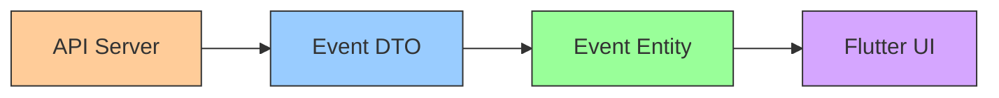
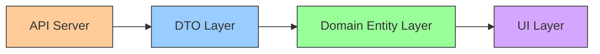
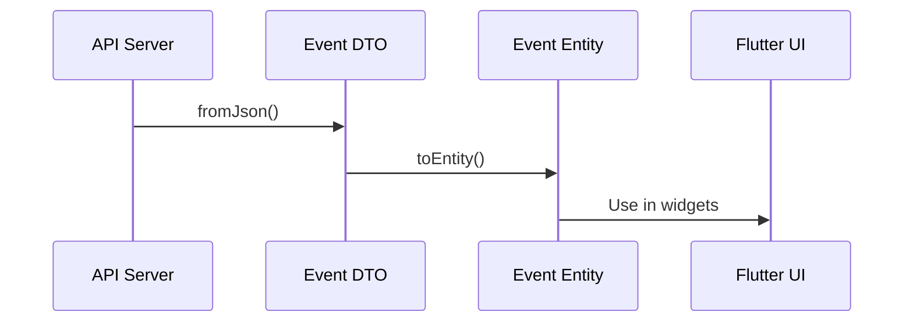
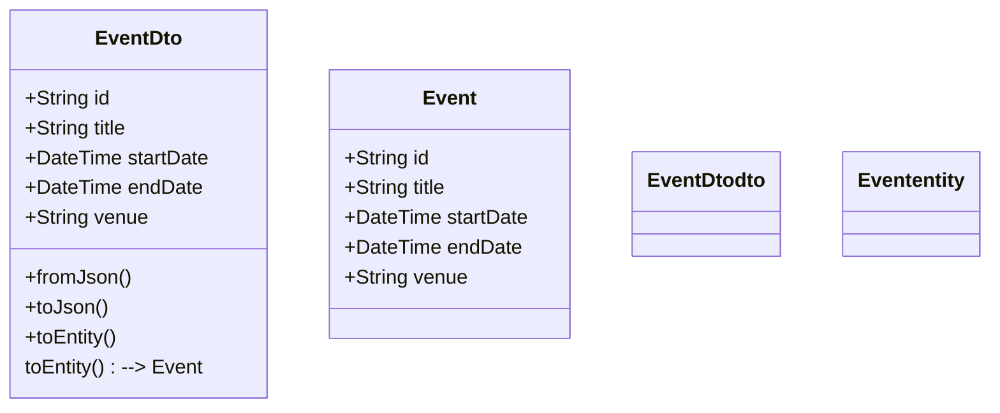

# Flutter Study Notes: DTO & DTO Mapping

---

## What is a DTO?

A **DTO (Data Transfer Object)** is a simple class used to transfer data between different parts of a system, especially between your app and external sources like APIs or databases.

- **DTOs** represent the shape of data as received from or sent to an API.
- They are often different from your app's core business models (entities).

---

## Why Use DTOs?

- APIs often return data with extra fields, different naming, or formats that don't match your app's needs.
- DTOs help keep your domain models clean and focused on business logic.
- They make serialization/deserialization easy and reliable.
- They allow you to adapt to backend changes without breaking your app's core logic.

---

## DTO vs Entity

| Aspect        | DTO (Data Layer)      | Entity (Domain Layer)     |
| ------------- | --------------------- | ------------------------- |
| Purpose       | API/data transfer     | Business logic/model      |
| Mutability    | Usually immutable     | Always immutable          |
| Serialization | Yes (fromJson/toJson) | Sometimes (rarely needed) |
| Extra Fields  | May have extra fields | Only core fields          |
| Mapping       | toEntity()            | -                         |

---

## Professional Mermaid Diagrams: DTO & Mapping

### API → DTO → Entity → UI Flow



### Clean Architecture Data Flow



### DTO to Entity Mapping Sequence



### Class Diagram: DTO vs Entity



---

## Real Flutter Example: DTO & Mapping

```dart
import 'package:freezed_annotation/freezed_annotation.dart';
import 'event.dart'; // domain entity

part 'event_dto.freezed.dart';
part 'event_dto.g.dart';

@freezed
class EventDto with _$EventDto {
  const factory EventDto({
    required String id,
    required String title,
    required DateTime startDate,
    required DateTime endDate,
    required String venue,
  }) = _EventDto;

  factory EventDto.fromJson(Map<String, dynamic> json) => _$EventDtoFromJson(json);

  // Mapping: Convert DTO to domain entity
  Event toEntity() => Event(
    id: id,
    title: title,
    startDate: startDate,
    endDate: endDate,
    venue: venue,
  );
}
```

---

## Common Mistakes

- Mixing DTOs and entities (leads to messy code)
- Not handling nulls or missing fields from API
- Forgetting to run build_runner for code generation
- Adding business logic to DTOs (should be pure data)
- Not separating data and domain layers

---

## Summary

- **DTOs** are for data transfer and serialization.
- **Entities** are for business logic and core modeling.
- **Mapping** keeps your architecture clean and maintainable.
- Use `@JsonSerializable` and Freezed for robust, immutable DTOs.
- Always separate DTOs and entities for scalable Flutter apps.
