# Capstone Project: EventHub — Event Management & Ticketing App

---

## Project Overview

**EventHub** is a production-grade event management and ticketing platform. Organizers create events, manage guest lists, and scan tickets. Attendees browse events, purchase tickets, receive push notifications, and check in via QR codes.

This single project exercises **all 21 advanced concepts** from the docs.

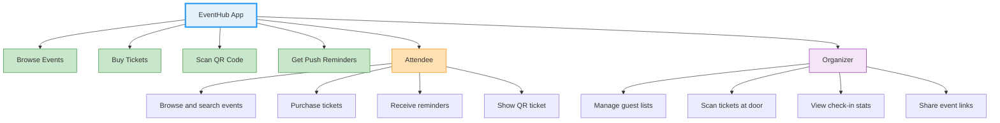

### Why This Project?

| Requirement                           | Concepts Exercised                                  |
| ------------------------------------- | --------------------------------------------------- |
| User authentication (OTP-based)       | Auth sealed state, token refresh, router guard      |
| Event listing with filters/search     | Riverpod AsyncNotifier, family providers, select()  |
| Event detail with real-time updates   | GraphQL queries, derived providers                  |
| Ticket purchase flow                  | REST API (Retrofit), form validation errors (422)   |
| Offline event browsing                | Drift database, DAO pattern, cache fallback         |
| QR ticket scanning                    | mobile_scanner, camera controls                     |
| Push notification for event reminders | FCM, local notifications, channels                  |
| Deep link to event from shared URL    | App Links, Universal Links, GoRouter                |
| Multi-language support (EN/AR)        | Slang i18n, RTL layout                              |
| Dark mode + brand theming             | M3 seed theming, ThemeExtension, theme persistence  |
| Responsive phone/tablet layout        | AppSpacing, breakpoints                             |
| Feature flags (disable ticket sales)  | Remote config, typed getters                        |
| Environment management                | dart-define-from-file                               |
| CI/CD pipeline                        | GitHub Actions, Fastlane, Firebase App Distribution |
| 80% test coverage                     | Unit, widget, integration tests                     |

---

## Architecture Proposal

### High-Level Architecture

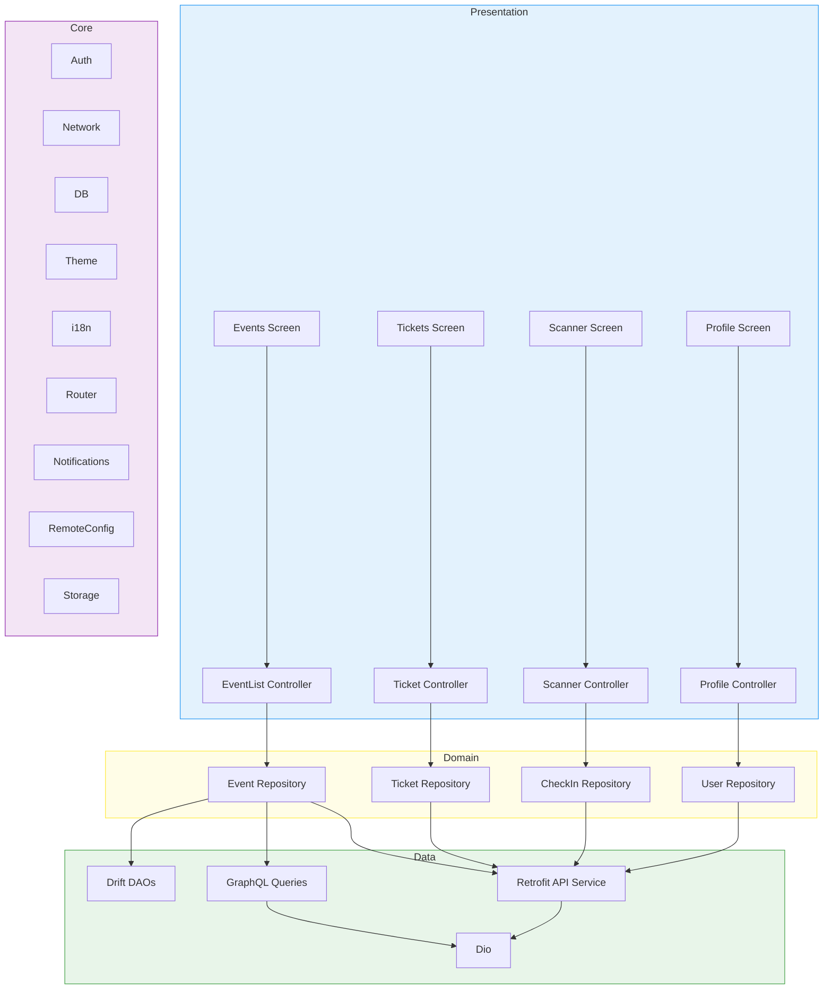

### Feature Slices

```
lib/
├── main.dart
├── app.dart
├── core/
│   ├── auth/                    # AuthState, AuthController, token providers
│   ├── database/                # AppDatabase, table defs, migrations
│   ├── di/                      # App-wide providers (AppConfig, DB)
│   ├── router/                  # GoRouter, auth guard, route composition
│   ├── network/                 # Dio client, interceptors, GraphQL client
│   ├── notifications/           # NotificationService, channels
│   ├── remote_config/           # Config fetch, typed getters, caching
│   ├── storage/                 # SharedPreferences wrapper
│   ├── theme/                   # AppTheme, AppColors, AppSpacing
│   ├── i18n/                    # Slang-generated translations
│   └── utils/                   # Logger, constants
├── features/
│   ├── auth/                    # Login, OTP, auth API
│   ├── events/                  # Event list, detail, search, filters
│   ├── tickets/                 # Ticket purchase, my tickets, ticket detail
│   ├── scanner/                 # QR scanning, check-in validation
│   ├── profile/                 # User profile, settings, theme toggle
│   └── notifications/           # Notification inbox, preferences
├── shared/
│   ├── widgets/                 # PrimaryButton, ErrorView, LoadingIndicator
│   ├── models/                  # Cross-feature value objects
│   └── extensions/              # toUserMessage(), date formatting
├── assets/
│   ├── svg/                     # SVG icons (compiled to .vec)
│   ├── i18n/                    # en.i18n.yaml, ar.i18n.yaml
│   └── images/
└── config/
    ├── dev.json
    ├── staging.json
    └── prod.json
```

### Data Flow Per Feature

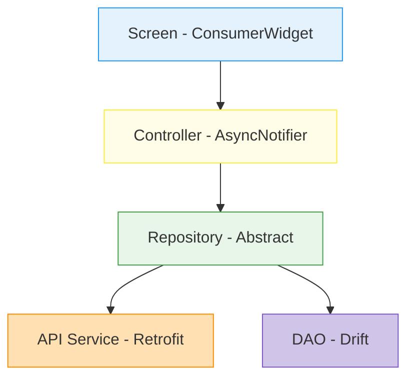

### Technology Stack Summary

| Layer              | Technology                                            |
| ------------------ | ----------------------------------------------------- |
| State Management   | Riverpod 3.x + `@riverpod` codegen                    |
| Navigation         | GoRouter                                              |
| REST Networking    | Dio + Retrofit                                        |
| GraphQL            | `graphql` + `gql_dio_link` + `graphql_codegen`        |
| Local Database     | Drift (SQLite)                                        |
| Data Classes       | Freezed + `json_serializable`                         |
| Auth               | Sealed state + `QueuedInterceptor` + GoRouter guard   |
| Theming            | M3 `ColorScheme.fromSeed()` + `ThemeExtension`        |
| Spacing            | Custom `AppSpacing` (elastic)                         |
| i18n               | Slang                                                 |
| Push Notifications | Firebase Messaging + Local Notifications              |
| Deep Linking       | App Links / Universal Links                           |
| QR Scanning        | `mobile_scanner`                                      |
| Remote Config      | Custom backend + SharedPreferences cache              |
| SVG                | `vector_graphics` (compiled assets)                   |
| Testing            | `flutter_test` + `mocktail`                           |
| CI/CD              | GitHub Actions + Fastlane + Firebase App Distribution |
| OTA Updates        | Shorebird                                             |

---

## Screens (Approximate)

| Feature       | Screen                 | Key Interactions                                       |
| ------------- | ---------------------- | ------------------------------------------------------ |
| Auth          | Login Screen           | Phone input → request OTP                              |
| Auth          | OTP Screen             | Verify OTP → receive tokens → redirect home            |
| Events        | Event List Screen      | Pull-to-refresh, filter chips, search, infinite scroll |
| Events        | Event Detail Screen    | GraphQL query, share deep link, buy ticket CTA         |
| Tickets       | Purchase Flow          | REST POST, form validation errors, success state       |
| Tickets       | My Tickets Screen      | List of purchased tickets, ticket status badge         |
| Tickets       | Ticket Detail Screen   | QR code display, event info, cancel option             |
| Scanner       | QR Scanner Screen      | Camera view, scan window, torch toggle                 |
| Scanner       | Check-In Result Screen | Valid/invalid/already-used states                      |
| Profile       | Profile Screen         | User info, theme toggle, language selector, logout     |
| Notifications | Notification Inbox     | Push history list, mark as read, tap → deep link       |

---

## API Surface (Mock)

### REST Endpoints (Retrofit)

```
POST   /auth/login              → { phone, otp } → { accessToken, refreshToken, user }
POST   /auth/refresh            → { refreshToken } → { accessToken, refreshToken }
GET    /events                  → query params: status, search, page, pageSize
POST   /tickets/purchase        → { eventId, quantity } → Ticket
GET    /tickets/mine            → List<Ticket>
POST   /scanner/checkin         → { ticketId } → CheckInResult
GET    /profile                 → User
PUT    /profile                 → { name, ... } → User
POST   /notifications/register  → { fcmToken }
GET    /configurations          → List<ConfigurationSetting>
```

### GraphQL Queries

```graphql
query GetEventDetail($id: UUID!) {
  event(id: $id) {
    id
    title
    description
    startDate
    endDate
    venue {
      name
      address
      latitude
      longitude
    }
    ticketTypes {
      id
      name
      price
      available
    }
    organizer {
      name
      avatarUrl
    }
  }
}

query GetEvents(
  $status: EventStatus!
  $search: String
  $first: Int
  $after: String
) {
  events(status: $status, search: $search, first: $first, after: $after) {
    nodes {
      id
      title
      coverImageUrl
      startDate
      venue {
        name
      }
    }
    pageInfo {
      hasNextPage
      endCursor
    }
  }
}
```

---

## Milestones

```mermaid
flowchart LR
  M1[M1 Scaffold Wk 1-2] --> M2[M2 State Wk 3-4]
  M2 --> M3[M3 Network and Auth Wk 5-8]
  M3 --> M4[M4 DB Wk 9-10]
  M4 --> M5[M5 GraphQL and Config Wk 11-12]
  M5 --> M6[M6 UI Polish Wk 13-14]
  M6 --> M7[M7 Platform Features Wk 15-16]
  M7 --> M8[M8 Testing Wk 17-18]
  M8 --> M9[M9 CI/CD Wk 19-20]
  style M1 fill:#e3f2fd,stroke:#2196f3
  style M2 fill:#fffde7,stroke:#ffeb3b
  style M3 fill:#e8f5e9,stroke:#43a047
  style M4 fill:#f3e5f5,stroke:#8e24aa
  style M5 fill:#b2dfdb,stroke:#00897b
  style M6 fill:#ffe0b2,stroke:#fb8c00
  style M7 fill:#d1c4e9,stroke:#7e57c2
  style M8 fill:#c8e6c9,stroke:#388e3c
  style M9 fill:#ffd600,stroke:#ff6f00,stroke-width:2px
```

### M1: Project Scaffold & Foundation (Week 1–2)

**Concepts:** C2, C3, C16

- [x] Initialize Flutter project with proper directory structure
- [x] Configure `pubspec.yaml` with all dependencies
- [x] Set up `build.yaml` for all generators
- [x] Create Freezed entities: `Event`, `Ticket`, `User`, `CheckInResult`
- [x] Create DTOs with `@JsonSerializable` and `toEntity()` methods
- [x] Set up barrel files for each feature
- [x] Configure environment JSON files (`dev.json`, `staging.json`, `prod.json`)
- [x] Run `build_runner` — all generators pass
- [x] Verify project compiles with `flutter analyze`

**Exit Criteria:** Project scaffold matches `project-structure.md` conventions. All entities and DTOs generate correctly.

```
M1 — What You Build:

  lib/
  ├── main.dart ─────────────── entry point
  ├── app.dart ──────────────── MaterialApp.router
  ├── core/ ─────────────────── shared infrastructure
  │   ├── auth/                 (empty — ready for M3)
  │   ├── database/             (empty — ready for M4)
  │   ├── network/              (empty — ready for M3)
  │   └── theme/                (empty — ready for M6)
  ├── features/
  │   ├── events/
  │   │   ├── events.dart ───── barrel file
  │   │   ├── providers.dart
  │   │   ├── domain/
  │   │   │   └── entities/
  │   │   │       ├── event.dart ◀── @freezed
  │   │   │       └── event.freezed.dart ◀── generated
  │   │   └── data/
  │   │       └── models/
  │   │           ├── event_dto.dart ◀── @freezed + @JsonSerializable
  │   │           ├── event_dto.freezed.dart
  │   │           └── event_dto.g.dart ◀── fromJson/toJson
  │   └── tickets/
  │       └── (same structure)
  └── config/
      ├── dev.json ──────────── {"API_BASE_URL": "https://api-dev..."}
      ├── staging.json
      └── prod.json
```

---

### M2: State Management Layer (Week 3–4)

**Concepts:** C1, C3

- [x] Create `dioProvider` (singleton, `keepAlive`)
- [x] Wire feature provider graphs: API → Repository → Controller
- [x] Implement `EventListController` (AsyncNotifier) with pagination
- [x] Implement `EventDetailController` with family provider (`build(String eventId)`)
- [x] Create derived provider: `upcomingEventsProvider` (filtered)
- [x] Demonstrate `select()` optimization on event count
- [x] Wire `ref.listen` for showing error snackbars
- [x] Implement `ref.invalidateSelf()` for pull-to-refresh

**Exit Criteria:** Full Riverpod provider graph for events feature. Loading → Data → Error states all handled.

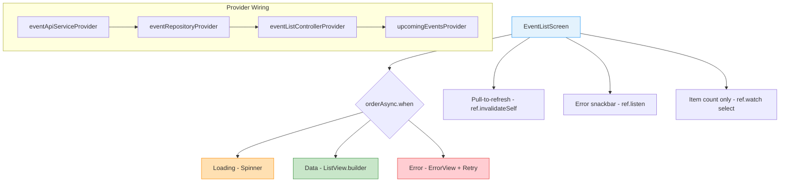

---

### M3: Networking & Authentication (Week 5–8)

**Concepts:** C4, C5, C6

- [ ] Build Dio client with interceptor chain: Error → Auth → Log
- [ ] Implement `AppException` sealed class (all 5 variants)
- [ ] Implement `ErrorInterceptor` with exhaustive `DioException` mapping
- [ ] Build Retrofit API services: `AuthApi`, `EventApi`, `TicketApi`, `ScannerApi`
- [ ] Implement `AuthState` sealed class
- [ ] Build `AuthController` with `login()` / `logout()`
- [ ] Implement `QueuedInterceptor` for token refresh
- [ ] Set up GoRouter with auth guard redirect
- [ ] Build login screen → OTP screen → redirect to home
- [ ] Implement `toUserMessage()` extension for error display
- [ ] Token persistence via SharedPreferences

**Exit Criteria:** Full auth lifecycle works. 401 → refresh → retry or logout works. Error snackbars show localized messages.

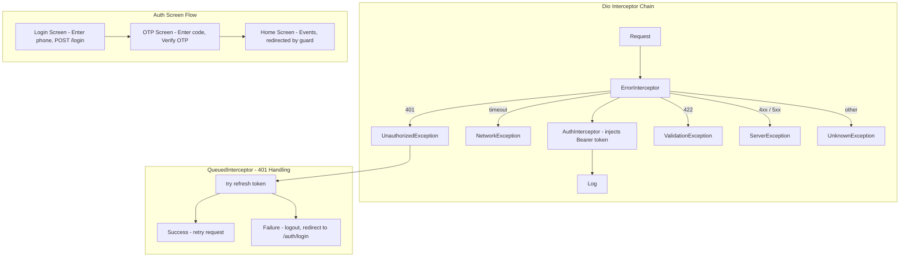

---

### M4: Local Database (Week 9–10)

**Concepts:** C7

- [ ] Define Drift tables: `Events`, `Tickets`, `CachedUsers`
- [ ] Create `AppDatabase` in `core/database/`
- [ ] Build feature DAOs: `EventDao`, `TicketDao`
- [ ] Implement `watch()` streams for reactive UI updates
- [ ] Update repository implementations: remote-first with cache fallback
- [ ] Implement schema migration (add a column, test the upgrade path)
- [ ] Test with in-memory database

**Exit Criteria:** App works offline (shows cached data). Migration tested. Reactive streams update UI when cache changes.

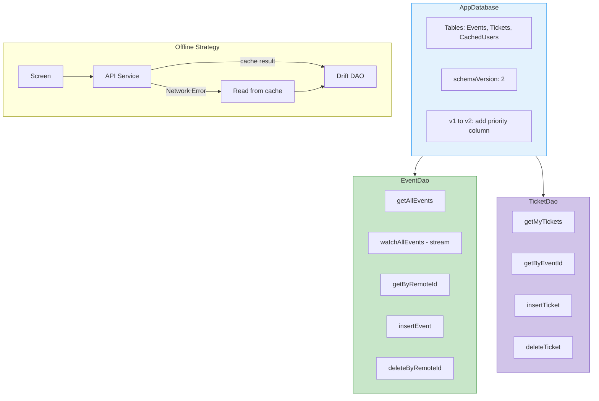

---

### M5: GraphQL & Remote Config (Week 11–12)

**Concepts:** C4 (GraphQL), C14, C16

- [ ] Set up GraphQL client provider with DioLink
- [ ] Download/create schema file
- [ ] Write `GetEventDetail.graphql` and `GetEvents.graphql`
- [ ] Run codegen — typed query/variable/result classes generated
- [ ] Build `EventRemoteDataSource` using generated GraphQL extensions
- [ ] Implement remote config: fetch → cache → typed getters
- [ ] Add feature flag: `isTicketSalesEnabled` controlling purchase CTA visibility
- [ ] Load config during splash, available synchronously to all features
- [ ] Set up `AppConfig` provider with `--dart-define-from-file`

**Exit Criteria:** Event detail loads via GraphQL. Feature flag hides/shows purchase button. Environment switching works.

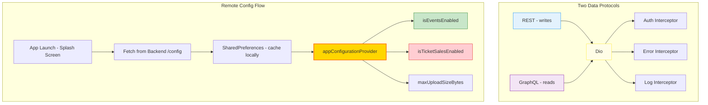

---

### M6: UI Polish — Theming, i18n, Responsive (Week 13–14)

**Concepts:** C8, C9, C10, C20

- [ ] Build `AppTheme` with `ColorScheme.fromSeed()` + brand overrides
- [ ] Create `ThemeExtension<AppColors>` with success/warning/info tokens
- [ ] Implement `ThemeModeNotifier` with SharedPreferences persistence
- [ ] Build `AppSpacing` elastic spacing utility
- [ ] Apply responsive layout to event list: single-column phone, two-column tablet
- [ ] Set up Slang with `en.i18n.yaml` and `ar.i18n.yaml`
- [ ] Replace all hardcoded strings with `t.key.subkey`
- [ ] Configure SVG → `.vec` compilation
- [ ] Set up `flutter_native_splash`
- [ ] Review: zero `Colors.*` references in widget files
- [ ] Review: zero hardcoded font sizes

**Exit Criteria:** Light/dark mode toggle works. Arabic locale works. Tablet layout adapts. All icons are SVG-compiled.

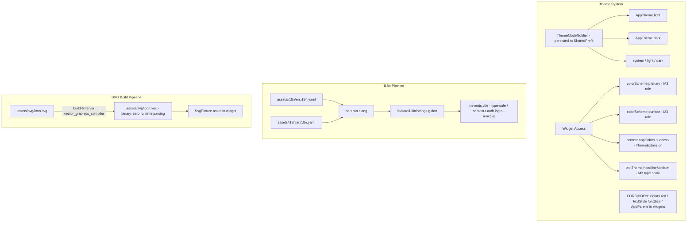

---

### M7: Platform Features (Week 15–16)

**Concepts:** C11, C12, C13, C19

- [ ] Configure Android App Links (`assetlinks.json`, intent-filter)
- [ ] Configure iOS Universal Links (`apple-app-site-association`, entitlements)
- [ ] Deep link `https://eventhub.com/app/events/{id}` opens Event Detail
- [ ] Handle initial link (app opened from terminated state)
- [ ] Set up FCM: `google-services.json`, APNs key
- [ ] Build `NotificationService` with channels (events, reminders)
- [ ] Foreground notification display via local notifications
- [ ] Tap notification → deep link → navigate to correct screen
- [ ] Build QR Scanner screen with scan window and torch toggle
- [ ] Process QR result → POST check-in → show valid/invalid result
- [ ] Add adaptive dialogs for confirm actions (cancel ticket, logout)

**Exit Criteria:** Share event link → tap → app opens to event detail. Push received in all app states. QR check-in works end-to-end.

```mermaid
flowchart TD
    subgraph DL["Deep Linking"]
        ANDROID["Android App Links - assetlinks.json, autoVerify"]
        IOS["iOS Universal Links - AASA file, Associated Domains"]
        APPLINKS["app_links package"]
        ROUTER["GoRouter resolves routes"]
        EVT["EventDetailScreen via /events/:id"]
        TKT["TicketDetailScreen via /tickets/:id"]
        ANDROID --> APPLINKS
        IOS --> APPLINKS
        APPLINKS --> ROUTER
        ROUTER --> EVT
        ROUTER --> TKT
    end

    subgraph PUSH["Push Notifications"]
        FCM["FCM Server"]
        FBM["firebase_messaging"]
        FG["Foreground - onMessage"]
        BG["Background - onBgMsg"]
        TM["Terminated - getInitialMsg"]
        LOCAL["flutter_local_notifications - show and handle tap"]
        ROUTE["GoRouter.go deepLink"]
        FCM -->|"message payload"| FBM
        FBM --> FG
        FBM --> BG
        FBM --> TM
        FG --> LOCAL
        BG --> LOCAL
        TM --> LOCAL
        LOCAL -->|"route from payload"| ROUTE
    end

    subgraph QR["QR Code Scanning"]
        SCANNER["mobile_scanner v7 - ML Kit / Vision"]
        SCAN["Scan Window with Guided Overlay"]
        PARSE["Parse QR Payload - ticketId, code"]
        POST["POST /check-in"]
        SUCCESS["Success"]
        ALREADY["Already Used"]
        INVALID["Invalid"]
        SCANNER --> SCAN
        SCAN --> PARSE
        PARSE --> POST
        POST --> SUCCESS
        POST --> ALREADY
        POST --> INVALID
    end
```

---

### M8: Testing (Week 17–18)

**Concepts:** C18

- [ ] Set up test helpers: `mocks.dart`, `fakes.dart`, `test_app.dart`
- [ ] Unit tests: all Freezed entities (equality, copyWith, serialization)
- [ ] Unit tests: repository implementations (API success, API failure → cache)
- [ ] Controller tests: `ProviderContainer` with mock repository overrides
- [ ] Widget tests: every screen (data, loading, error states)
- [ ] Drift tests: DAO operations with in-memory database
- [ ] Integration test: login → view events → purchase ticket → view my tickets
- [ ] Achieve 80%+ coverage on `events` and `tickets` features
- [ ] Run `flutter test --coverage` and verify

**Exit Criteria:** 80%+ coverage on two features. All widget tests pass. Integration test passes.

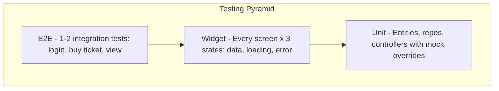

Test Infrastructure:

```
test/
├── helpers/
│   ├── mocks.dart           -- @GenerateMocks
│   ├── fakes.dart           -- FakeEvent, FakeTicket
│   └── test_app.dart        -- ProviderScope + overrides + MaterialApp
│
├── features/
│   ├── events/
│   │   ├── data/
│   │   │   └── events_repo_test.dart    -- mock API, verify fallback
│   │   ├── domain/
│   │   │   └── event_entity_test.dart   -- equality, copyWith, JSON
│   │   ├── presentation/
│   │   │   ├── events_controller_test.dart -- ProviderContainer
│   │   │   └── events_screen_test.dart    -- pump + verify widgets
│   │   └── drift/
│   │       └── events_dao_test.dart     -- in-memory DB
│   └── tickets/
│       └── ...  (mirror events)
│
└── integration/
    └── purchase_flow_test.dart          -- full login, purchase, view
```

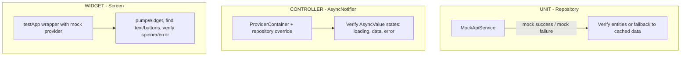

---

### M9: Performance & CI/CD (Week 19–20)

**Concepts:** C15, C17

- [ ] Audit all lists for `ListView.builder` usage
- [ ] Add `const` constructors where missing
- [ ] Add `itemExtent` to uniform-height lists
- [ ] Replace `Image.network` with `CachedNetworkImage`
- [ ] Profile with DevTools: all frames under 16ms
- [ ] Measure cold start: under 3s on mid-range device
- [ ] Set up GitHub Actions CI workflow: analyze → test → build
- [ ] Configure Fastlane for iOS (Match + Firebase App Distribution)
- [ ] Configure Fastlane for Android (Firebase App Distribution)
- [ ] Set up Shorebird: `shorebird init`, `shorebird release`
- [ ] Test OTA patch: `shorebird patch android`
- [ ] Add caching to CI (pub, Gradle, CocoaPods)

**Exit Criteria:** CI green on every push. Beta distributed to testers. OTA patch delivered successfully.

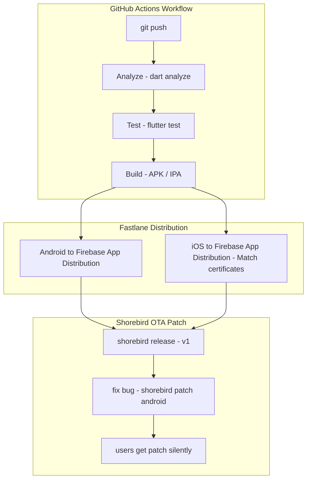

Cache Strategy (speeds up CI by ~60%):

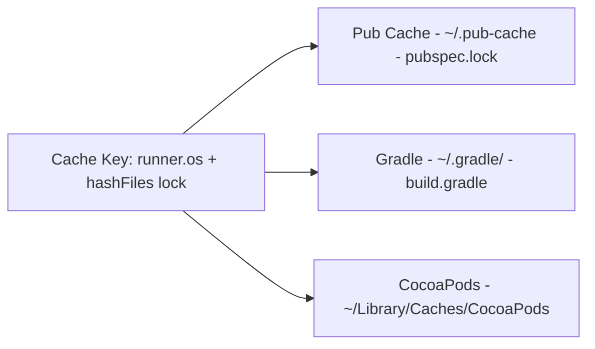

Performance Budgets:

| Metric          | Budget         | Tool        |
| --------------- | -------------- | ----------- |
| Frame render    | less than 16ms | DevTools    |
| Cold start      | less than 3s   | Stopwatch   |
| APK size        | less than 25MB | --analyze   |
| Widget rebuilds | minimal        | select      |
| List scrolling  | 60fps          | builder+ext |
| Image loading   | cached         | CachedImg   |
| SVG rendering   | precomp        | .vec files  |

---

## Spec-First Workflow

For every feature, follow this sequence **before writing any code**:

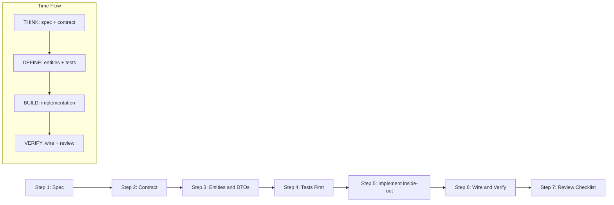

### Step 1: Spec (Document)

```
docs/specs/<feature>-spec.md
├── Problem statement
├── User stories (As a..., I want..., So that...)
├── Acceptance criteria (Given/When/Then)
├── API contract (request/response shapes)
├── Screen wireframes (ASCII or Figma link)
└── Edge cases & error states
```

Example spec structure:

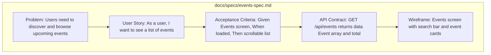

### Step 2: Contract (Interfaces)

```dart
// domain/repositories/<feature>_repository.dart
abstract class FeatureRepository {
  Future<List<Entity>> getAll();
  Future<Entity> getById(String id);
  Future<void> create(CreateRequest request);
}

// Dependency direction:
//
//   ┌──────────────┐        ┌──────────────────┐
//   │ Presentation │ ─uses─▶│ Domain           │
//   │ (Controller) │        │ (Abstract Repo)  │
//   └──────────────┘        └────────▲─────────┘
//                                    │ implements
//                           ┌────────┴─────────┐
//                           │ Data             │
//                           │ (RepoImpl+API)   │
//                           └──────────────────┘
```

### Step 3: Entities & DTOs

```dart
// domain/entities/entity.dart     → Freezed, no JSON
// data/models/entity_dto.dart     → Freezed + JSON, toEntity()

// Conversion flow:
//
//   API JSON ──fromJson──▶ EventDto ──toEntity()──▶ Event (domain)
//                               │
//                               ▼
//                          EventsCompanion ──▶ Drift DB (local cache)
```

### Step 4: Tests First

```dart
// Write failing tests for repository, controller, and screen
// They define expected behavior before implementation exists

// Red → Green → Refactor:
//
//   ┌─────────┐     ┌─────────┐     ┌───────────┐
//   │  RED    │────▶│  GREEN  │────▶│ REFACTOR  │
//   │ Write   │     │ Make it │     │ Clean up  │
//   │ failing │     │ pass    │     │ keep green│
//   │ test    │     │         │     │           │
//   └─────────┘     └─────────┘     └───────────┘
```

### Step 5: Implementation (Inside-Out)

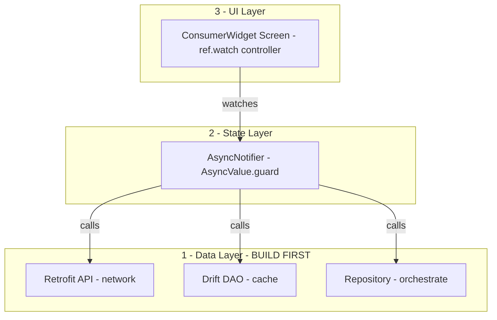

### Step 6: Wire & Verify

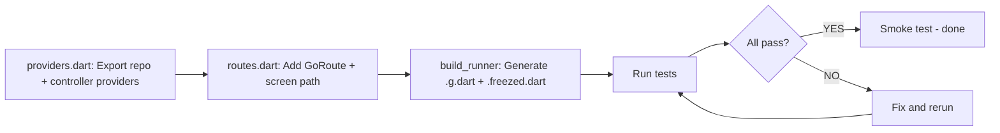

### Step 7: Review Checklist

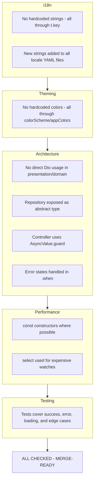

---

## Concept Coverage Matrix

| Concept                                   | Milestone(s)                  |
| ----------------------------------------- | ----------------------------- |
| C1. State Management (Riverpod)           | M2, M3, M4, M5                |
| C2. Clean Architecture (Feature Slices)   | M1, M2, M3, M4, M5            |
| C3. Code Generation                       | M1, M2, M3, M4, M5, M6        |
| C4. Networking (Dio + Retrofit + GraphQL) | M3, M5                        |
| C5. Error Handling                        | M3                            |
| C6. Authentication                        | M3                            |
| C7. Local Database (Drift)                | M4                            |
| C8. Theming (M3)                          | M6                            |
| C9. Responsive Design                     | M6                            |
| C10. Internationalization (Slang)         | M6                            |
| C11. Deep Linking                         | M7                            |
| C12. Push Notifications                   | M7                            |
| C13. QR Scanning                          | M7                            |
| C14. Remote Config                        | M5                            |
| C15. Performance                          | M9                            |
| C16. Environment Config                   | M1, M5                        |
| C17. CI/CD                                | M9                            |
| C18. Testing                              | M8                            |
| C19. Platform-Specific                    | M7                            |
| C20. Splash + SVG                         | M6                            |
| C21. Phased Retry (Backend)               | M3 (error handling awareness) |

**Every concept from the docs is exercised at least once.**
